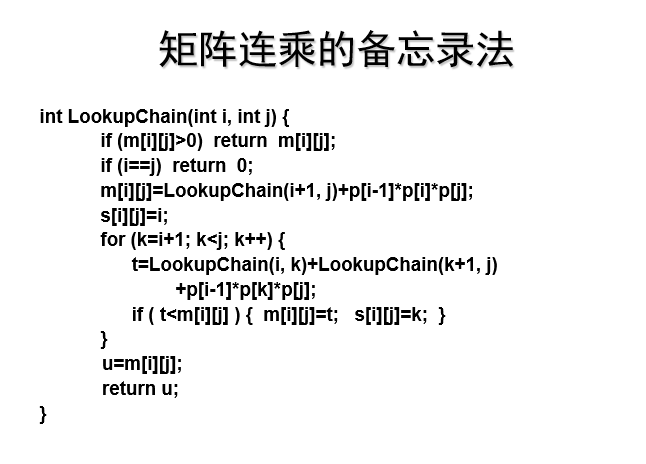
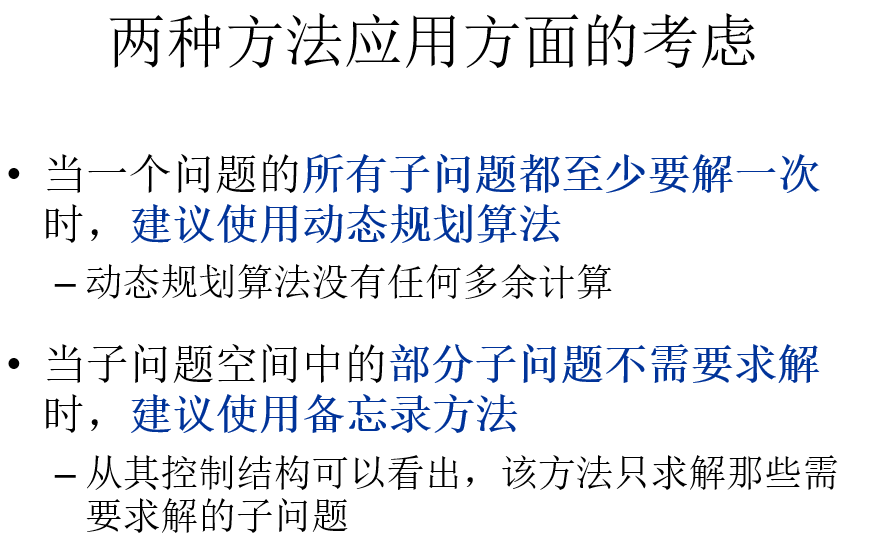

是一种通过把原问题分解为相对简单的子问题的方式求解复杂问题的方法。

<!--more-->

## 要素
1. 最优子结构
    问题的最优解中包含了子问题的最优解
    比如矩阵连乘中的最优解min2d[1][4]中肯定也包含了min[2][4]的最优解

    动态规划是自底向上的，在前面步骤做出了最优决策，那么之后的最优决策也必须在前面的最优决策基础上建立
    如果不能保证最优原则（–所谓最优化原理即不管前面的策略如何，此后的决策必须是基于当前状态（由上一次决策产生）的最优决策。）
    那么不能采用动态规划
2. 子问题重叠
    –用递归算法子顶向下求解问题时，每次产生的子问题之间存在重叠现象。
  如果子问题不重叠，那其实和直接递归分治没什么区别

## 动态规划的标准解题方法
1.先分析问题的最优子结构，这一过程的关键就是你去先用一个变量来表示问题的最优值，比如m[i][j]或者m(i,j)之类的，其中i或者j是代表问题的规模n。另一个是一个常量，限制条件什么的。这样的话就可以把问题的解化为去求m[n][1],m(n,c)之类的式子。将问题抽象表示完了之后，再去试图分析m[n][1]和m[n-1][1]之类的关系，把一个规模为n的问题化成规模变小为n-1的问题，试图去证明m[n][1]中的解包含了m[n-1][1]问题的解，这里一般用反证法。

2.紧接着第1步分析，根据实际问题去推理出，m[i][1]和m[i-1][1]之间的关系，并用数学式子表现出来。一般情况下会是m[i][1]=m[i-1][1]+p之类的形式。这一步可能需要分情形讨论，同时应该会有一个递归出口，即i到了一定小的规模 等于0啊或者等于1之类的时候有直接的解，不需要再递归调用。

3.计算最优值，根据第2步分析出来的递归公式，一般采用递归函数的形式去模拟递归公式。比如说m[i][1] = m[i-1][1] +p可以换成类似mfunc(i)=mfunc(i-1)之类的式子，我们定义的求最优值的函数就是这个mfunc，函数前面部分会定义递归出口，或者查找备忘录之类的

4.在计算最优值中一般会记录一些关键信息，比如矩阵连乘中记录分点。然后之后再根据记录的这些信息Backtrace出最优解(这一步不一定需要)

## 备忘录方法



### 以上这个算法的分析
首先先查看m[i][j]这个的值，如果已经存在了就直接返回 避免重复计算//解决重叠子问题
其次如果i==j的话直接返回0,矩阵和自身相乘无需计算，这也是一个递归出口
递归调用LookupChain是将i和j的差逐渐缩小，所以出口就是i=j时

定义好了递归出口，同时建好了备忘录，以下就开始递归调用了

假设现在要求A1A2A3A4A5的最优解，那么显然需要知道先分成哪两半相乘
则有A1(A2A3A4A5)  | (A1A2)(A3A4A5) | (A1A2A3)(A4A5) | (A1A2A3A4)A5
这些选择，要知道哪个是最优的，则只好循环、比较
先假设第一个是最优的所以有
```cpp
m[i][j]=LookupChain(i+1, j)+p[i-1]*p[i]*p[j];
s[i][j]=i;
```
然后遍历后几个与他比较
```cpp
for (k=i+1; k<j; k++) {
    t=LookupChain(i, k)+LookupChain(k+1, j)+p[i-1]*p[k]*p[j];
    if ( t<m[i][j] ) {  
        m[i][j]=t;   
        s[i][j]=k;  
    }
}
```
找出真正最小的
之后将这个最小的值返回，以供调用
```cpp
u=m[i][j];
return u;
```

#### 两种方法应用方面的比较


