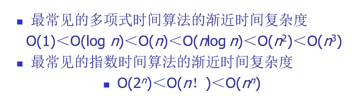
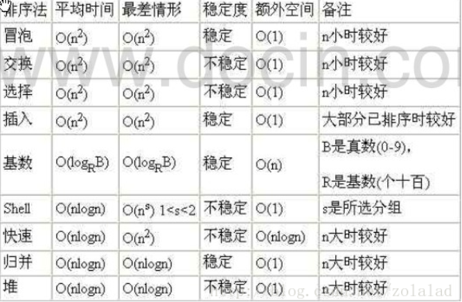

算法的一些基础,包括时间复杂度什么的,本系列是上算法课的笔记，此篇为起始篇
<!--more-->
### 算法满足的4个性质
1. 输入:有零个或的多个由外部提供的量作为算法的输入
2. 输出:算法产生至少一个量作为输出
3. 确定性:组成算法的每条指令都是清晰的，无歧义的
4. 有限性:算法中每条指令的执行次数都是有限的，每条指令的时间也是有限的
### 2种复杂度
- 时间复杂性
- 空间复杂性
**本书主要讨论时间复杂性**

### 时间复杂度
Ο(1)表示基本语句的执行次数是一个常数，一般来说，只要算法中不存在循环语句，其时间复杂度就是Ο(1)。其中Ο(log2n)、Ο(n)、 Ο(nlog2n)、Ο(n2)和Ο(n3)称为多项式时间，而Ο(2n)和Ο(n!)称为指数时间。计算机科学家普遍认为前者（即多项式时间复杂度的算法）是有效算法，把这类问题称为P（Polynomial,多项式）类问题，而把后者（即指数时间复杂度的算法）称为NP（Non-Deterministic Polynomial, 非确定多项式）问题。

#### 一些常见排序算法的复杂度

