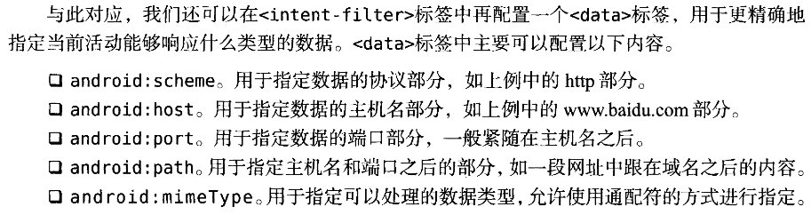
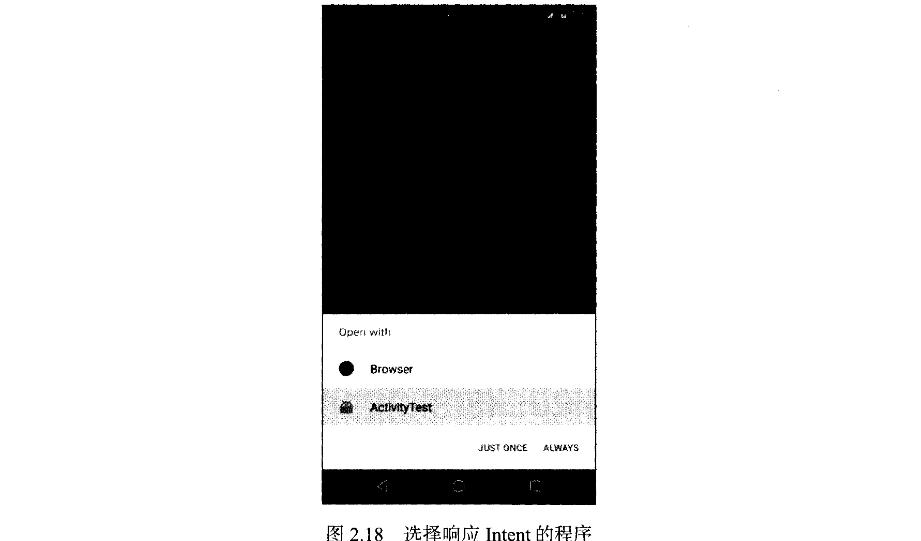
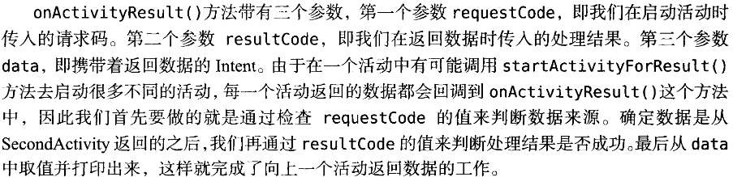
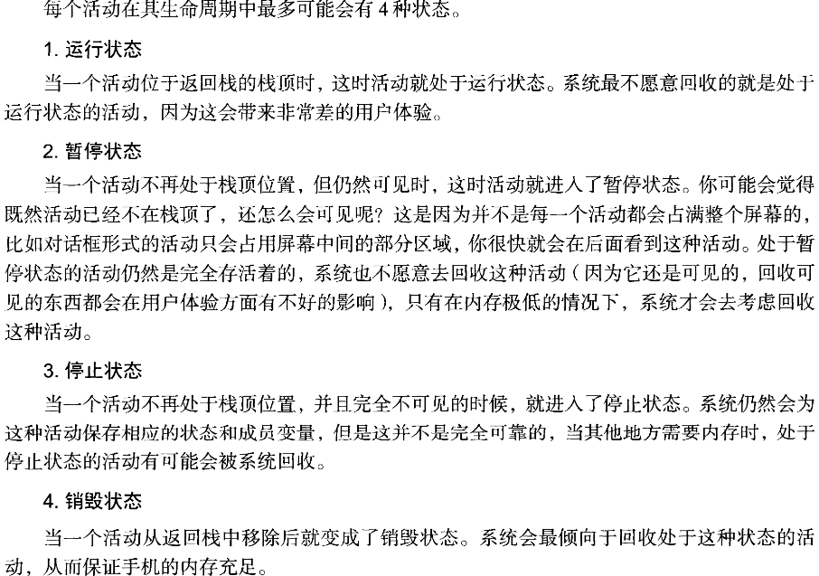
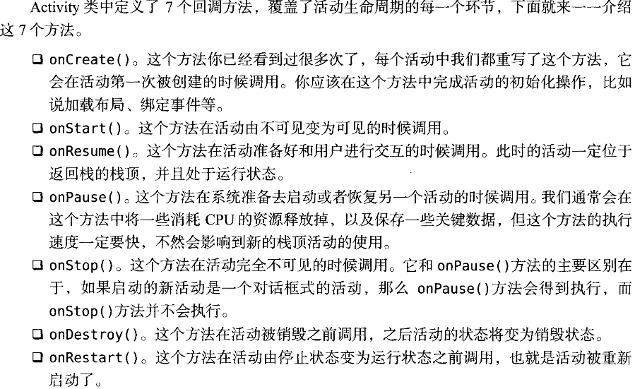
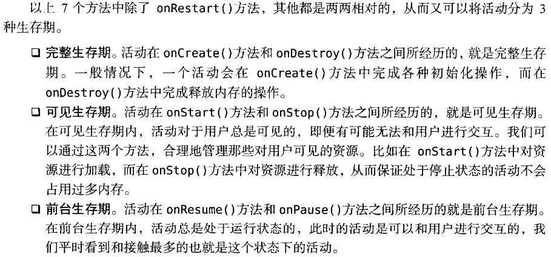
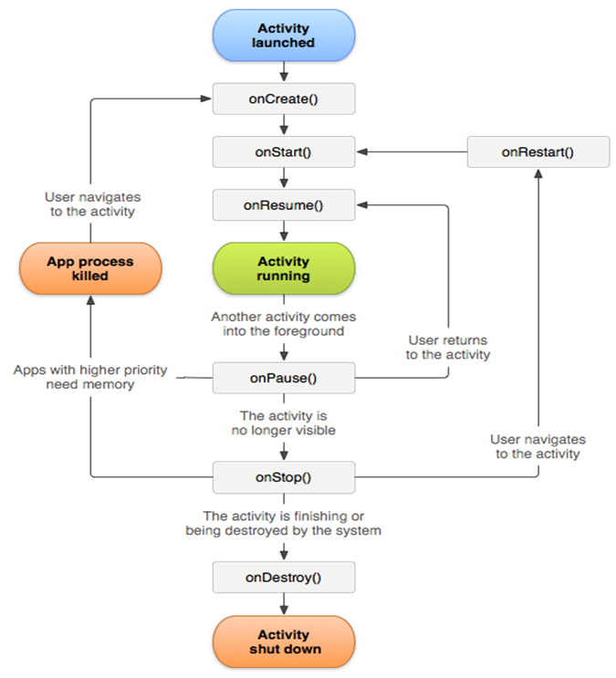

本篇是Android四大组件之一的Activity一些基本的操作，Activity的生命周期。以及Intent，Activity间的数据传递的一些基本介绍。

<!-- more -->
### 创建一个新Activity

一个活动对应一个布局

**活动**
```java
public class FirstActivity extends AppCompatActivity{
    @Override
    protected void onCreate(Bundle savedInstanceState){
        super.onCreate(savedInstanceState);
    }
}
```
**布局**
在app/src/main/res目录下新建一个layout目录，然后在该目录下新建first_layout.xml布局文件
```xml
<LinearLayout xmlns:android="http://schema.android.com/aok/res/android"
            android:orientation="vertical"
            android:layout_width="match_parent"
            android:layout_height="match_parent">
</LinearLayout>
```
**在活动里将布局引入进来**
setContentView(R.layout.first_layout);
```java
public class FirstActivity extends AppCompatActivity{
    @Override
    protected void onCreate(Bundle savedInstanceState){
        super.onCreate(savedInstanceState);
        setContentView(R.layout.first_layout);
    }
}
```
记得在AndroidManifest.xml里注册这个Activity

### 销毁Activity
在想要销毁的Activity内部使用finish();
```java
button1.setOnClickListener(new View.OnClickListener(){
    @Override
    public void onClick (View v){
        finish();
    }
})
```
按button1这个按钮就可以销毁活动

## Intent

### 显示Intent
```java
button1.setOnClickListener(new View.OnClickListener(){
    @Override
    public void onClick (View v){
        Intent intent = new Intent(FirstActivity.this,SecondAticity.class);
        startActivity(intent);
    }
})
```

### 隐式Intent
在AndroidManifest.xml为相应的Activity添加抽象的action和category信息，这些信息标注在他所处的Activity里的，在这里也就是SecondActivity

#### 隐式Intent action
**AndroidManifest.xml**
```xml
<activity android:name=".SecondActivity">
    <intent-filter>
        <action android:name="com.example.activitytest.ACTION_START"/>
        <category android:name="android.intent.category.DEFAULT"/>
    </intent-filter>
</activity>
```
**FirstActivity.java**
```java
button1.setOnClickListener(new View.OnClickListener(){
    @Override
    public void onClick (View v){
        Intent intent = new Intent("com.example.activitytest.ACTION_START");
        startActivity(intent);
    }
})
```
#### 隐式Intent action+category

**AndroidManifest.xml**
```xml
<activity android:name=".SecondActivity">
    <intent-filter>
        <action android:name="com.example.activitytest.ACTION_START"/>
        <category android:name="android.intent.category.DEFAULT"/>
        <category android:name="com.example.activitytest.MY_CATEGORY"/>
    </intent-filter>
</activity>
```
**FirstActivity.java**
```java
button1.setOnClickListener(new View.OnClickListener(){
    @Override
    public void onClick (View v){
        Intent intent = new Intent("com.example.activitytest.ACTION_START");
        intent.addCategory("com.example.activitytest.MY_CATEGORY")
        startActivity(intent);
    }
})
```
#### 更多隐式Intent
```java
button1.setOnClickListener(new View.OnClickListener(){
    @Override
    public void onClick(View v){
        Intent intent = new Intent(Intent.ACTION_VIEW);
        intent.setData(Uri.parse("http://www.baidu.com"));
        startActivity(intent);
    }
})
```


在AndroidManifest.xml中修改ThirdActivity的intent-filter

**AndroidManifest.xml**

```xml
<activity android:name=".ThirdActivity">
    <intent-filter>
        <action android:name="android.intent.action.VIEW"/>
        <category android:name="android.intent.category.DEFAULT"/>
        <data android:schema="http"/>
    </intent-filter>
</activity>
```

添加了data android:scheme="http"之后ThirdActivity可以响应action是Intent.ACTION_VIEW的常量值同时。他可以响应数据协议是http协议。这样的时候在FirstActivy中点击button1时

```java
button1.setOnClickListener(new View.OnClickListener(){
    @Override
    public void onClick(View v){
        Intent intent = new Intent(Intent.ACTION_VIEW);
        intent.setData(Uri.parse("http://www.baidu.com"));
        startActivity(intent);
    }
})
```
就会让我们在Browser和ActivityTest(含有ThirdActivity这个Activity的app)中二选一


除了http以外还有很多协议，geo表示显示地理位置，tel表示拨打电话
```java
button1.setOnClickListener(new View.OnClickListener(){
    @Override
    public void onClick(View v){
        Intent intent = new Intent(Intent.ACTION_DIAL);
        intent.setData(Uri.parse("tel:10086"));
        startActivity(intent);
    }
})
```
## 活动间数据传递

### 向下一个活动传递数据
Intent中提供了一些列的putExtra()方法的重载，这可以把我们想要传递的数据暂存在Intent中，启动了另一个活动后，再把这个数据从Intent中取出

在FirstActivity中，存入数据 ↓
```java
button1.setOnClickListener(new View.OnClickListener(){
    @Override
    public void onClick(View v){
        String data = "Hello SecondActivity";
        Intent intent = new Intent(FirstActivity.this,SecondActivity.class);
        intent.putExtra("extra_data",data)
        startActivity(intent);
    }
})
```
在SecondActivity中  取出数据 ↓

```java
public class SecondActivity extends AppCompatActivity{
    @override
    public void onCreate(Bundle savedInstanceState){
        super.onCreate(savedInstanceState);
        setContentView(R.layout.second_layout);
        Intent intent = getIntent();
        // getIntent()方法取到启动SecondActivity的Intent
        String data = intent.getStringExtra("extra_data");
        Log.d("SecondActivity",data);
    }
}
```
### 返回数据给上一个活动

按Back键没有一个用于启动活动的Intent来传递数据
Activity有一个startActivityForResult()方法也是启动活动，但这个方法期望活动销毁的时候能返回一个结果给上一个活动

在FirstActivity(期望得到数据的Activity)中编写如下代码
```java
button1.setOnClickListener(new View.OnClickListener(){
    @Override
    public void onClick(View v){
        Intent intent = new Intent(FirstActivity.this,SecondActivity.class);
        startActivityForResult(intent,1);
        // 这个1是requestCode
    }
})
```
这样点击button1就会用startActivityForResult()打开SecondActivity（打开这个Activity的目的就是为了它传数据回来）

SecondActivity传回数据的方法    ↓
```java
public class SecondActivity extends AppCompatActivity{
    @override
    public void onCreate(Bundle savedInstanceState){
        super.onCreate(savedInstanceState);
        setContentView(R.layout.second_layout);
        Button button2 = (Button) findViewById(R.id.button2);
        button2.setOnClickListener(new View.OnClickListener(){
            @Override
            public void onClick(View v){
                Intent intent = new Intent();
                //这个Intent仅仅是用于传递数据而已
                intent.putExtra("data_return","Hello FirstActivity");
                setResult(RESULT_OK,intent);
                //setResult()是关键方法，专门用于向上一个活动返回数据
                finish();
            }
        })
    }
}
```
由于我们是使用startActivityForResult()方法来启动SecondActivity的，在SecondActivity被销毁之后会回调上一个活动的**onActivityResult()**方法，因此我们需要在FirstActivity中重写这个方法来得到返回的数据，如下所示
```java
@Override
protected void OnActivityResult(int requestCode,int resultCode,Intent data){
    switch(requestCode){
        case 1:
            if(resultCode==RESULT_OK){
                String returnedData = data.getStringExtra("data_return");
                Log.d("FirstActivity",returnedData)
            }
            break;
        default:
    }
}
```

关于onActivityResult()
  


## Activity的生命周期

#### 活动状态



#### 生命周期钩子



#### 生命周期图


### onSaveInstanceState()
Activity提供了一个onSaveInstanceState()回调方法，这个方法它可以保证活动在被回收之前一定会被调用。用来保存要被回收的活动的一些重要数据

**保存**
在MainActivity.java
```java
@Override
protected void onSaveInstanceState(Bundle outState){
    super.onSaveInstanceState(outState);
    String temData = "Something you just type";
    outState.putString("data_key",temData);
}
```
**读取**
也在MainActivity.java
onCreate()方法其实也有一个Bundle类型的参数。这个参数在一般情况下都是null,但是如果在活动被系统回收之前有通过onSaveInstanceState()方法保存数据的话，这个参数就会带有之前保存的全部数据，我们只需要通过相应的取值方法取出即可
```java
@override
public void onCreate(Bundle savedInstanceState){
    super.onCreate(savedInstanceState);
    setContentView(R.layout.second_layout);
    if(savedInstanceState != null){
        String temData = savedInstanceState.getString("data_key");
        Log.d("SecondActivity",temData)
    }
}
```

### Intent结合Bundle使用

Intent可以结合Bundle使用，一起用于传递数据。首先可以把需要传递的数据都保存在Bundle对象中，然后再将Bundle对象存放在Intent里。到了目标活动后先从Intent中取出Bundle。再从Bundle中一一取出数据

### 活动的启动模式
详细的就不写了
- standard
- singleTop
- singleTask
- singInstance