Android中的广播机制很灵活，Android中每个应用程序都可以对自己感兴趣的广播进行注册。这样该程序就只会接收到自己所关心的广播内容。这些广播可能是来自于系统的，也可能是来自于其他应用程序的。Android提供了一套完整的API，允许应用程序自由地发送和接收广播。发送广播的方法之前稍微提到过。是借助Intent。而接收广播的方法需要引入全新的概念--广播接收器(Broadcast Receiver)

<!--more-->

**发送广播**
intent
**接收广播**
Broadcast Receiver

### 安卓中广播的两种类型：标准广播、有序广播
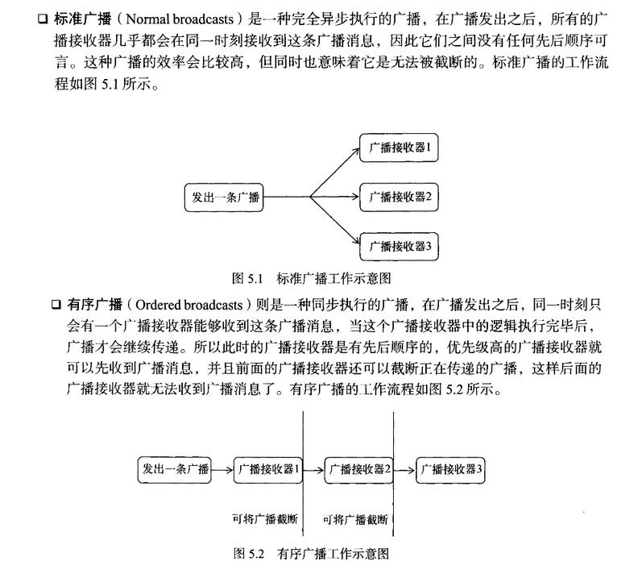

### 接收系统广播
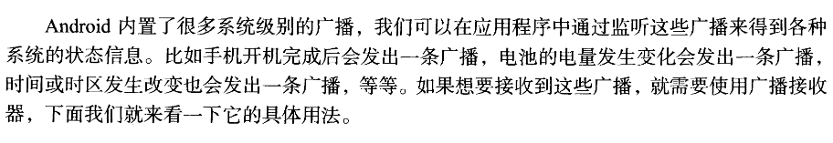

#### 动态注册监听网络变化
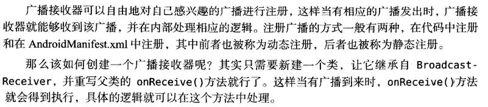

#### 动态注册java

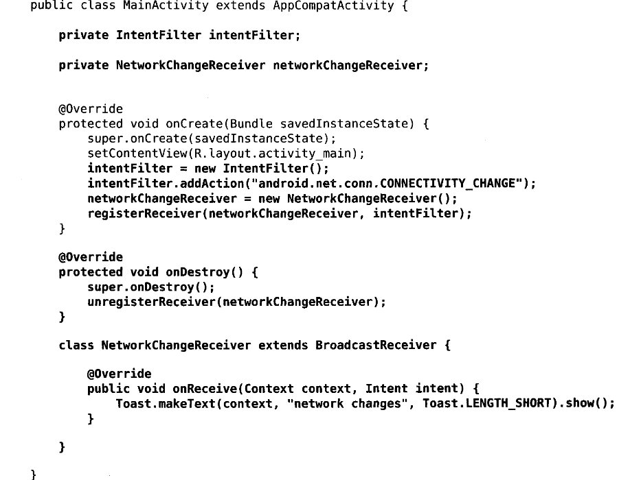

**以上代码的解释如下**

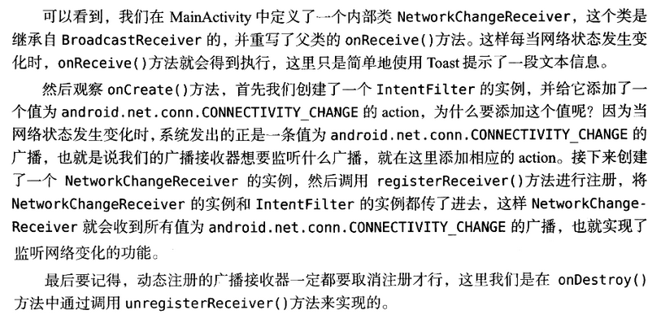

**同时以下代码还使用了获得系统服务的实例**

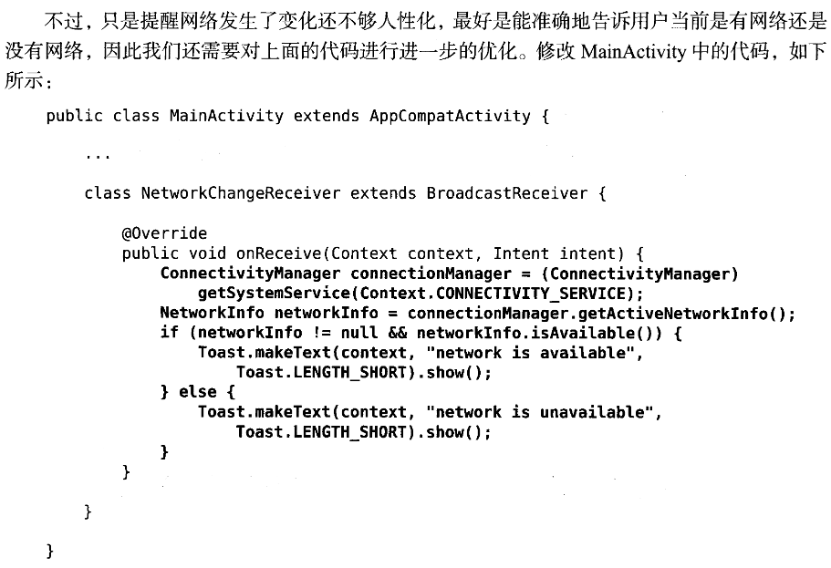

以下代码需要加在AndroidManifest.xml
```xml
<use-permission android:name="android.permission.ACCESS_NETWORK_STATE"/>
```

#### 静态注册实现开机启动

**动态注册的不足**
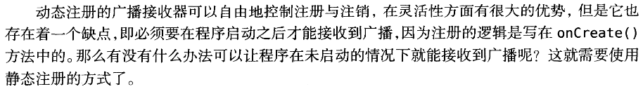
比如说需要实现开机启动就没办法了

**新建一个BroadcastReceiver**
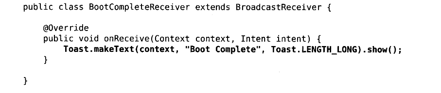

**在AndroidManifest.xml注册**
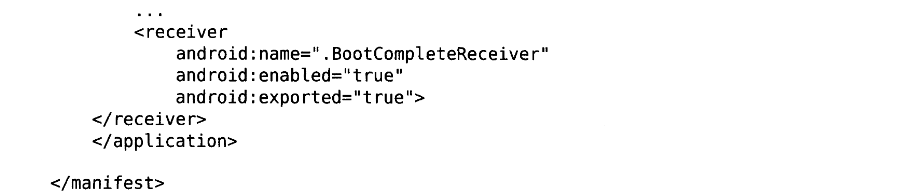

在AndroidManifest.xml中添加权限
```xml
<use-permission android:name="android.permission.RECEIVE_BOOT_COMPLETED"/>
```
Android系统启动完成后会发出一条值为android.intent.action.BOOT_COMPLETED的广播，我们需要在receiver中用intent-filter来监听这条广播


### 发送广播

#### 发送标准广播

**发送前先设置监听器**
```java
public class MyBroadcastReceiver extends BroadcastReceiver{
    @Override
    public void onReceive(Context context,Intent intent){
        Toast.makeText(context,"received in MyBroadcastReceiver",Toast.LENGTH_SHORT).show();
    }
}
```
**静态监听的xml**
```xml
<receiver
    android:name=".MyBroadcastReceiver"
    android:enabled="true"
    android:exported="true">
    <intent-filter>
        <action android:name="com.example.broadcasttest.MY_BROADCAST">
    </intent-filter>
</receiver>
```
**发送自定义广播**
```java
button.setOnClickListener(new View.OnClickListener(){
    @Override
    public void onClick(View v){
        Intent intent = new Intent("com.example.broadcasttest.MY_BROADCAST");
        sendBroadcast(intent);
    }
}); 
```
因为广播是通过intent发送的。所以同时还可以传递数据

#### 发送有序广播

**也是先创建一个广播接收器**
```java
public class AnotherBroadcastReceiver extends BroadcastReceiver{
    @Override
    public void onReceive(Context context,Intent intent){
        Toast.makeText(context,"received in AnotherBroadcastReceiver",Toast.LENGTH_SHORT).show();
    }
}
```
**静态监听的xml**
```xml
<receiver
    android:name=".AnotherBroadcastReceiver"
    android:enabled="true"
    android:exported="true">
    <intent-filter>
        <action android:name="com.example.broadcasttest.MY_BROADCAST">
    </intent-filter>
</receiver>
```

**发送有序与发送标准广播有不同之处**
```java
Intent intent = new Intent("com.example.broadcasttest.MY_BROADCAST");
sendOrderedBroadcast(intent,null);
```
这个时候广播接收器有先后顺序的，而且前面的广播接收器可以将广播截断，阻止他继续传播

**设定广播接收器优先级**
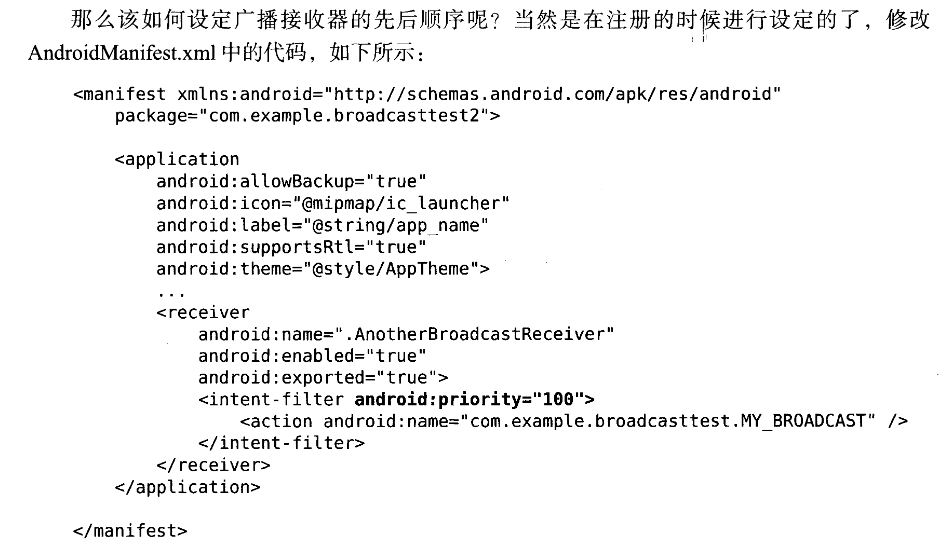

**截断广播**
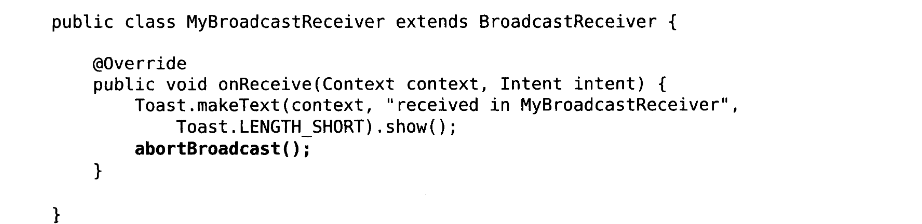

### 本地广播
简介
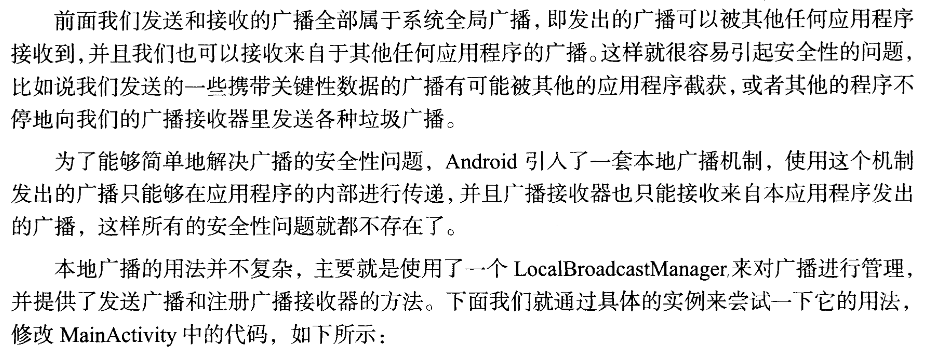

例子
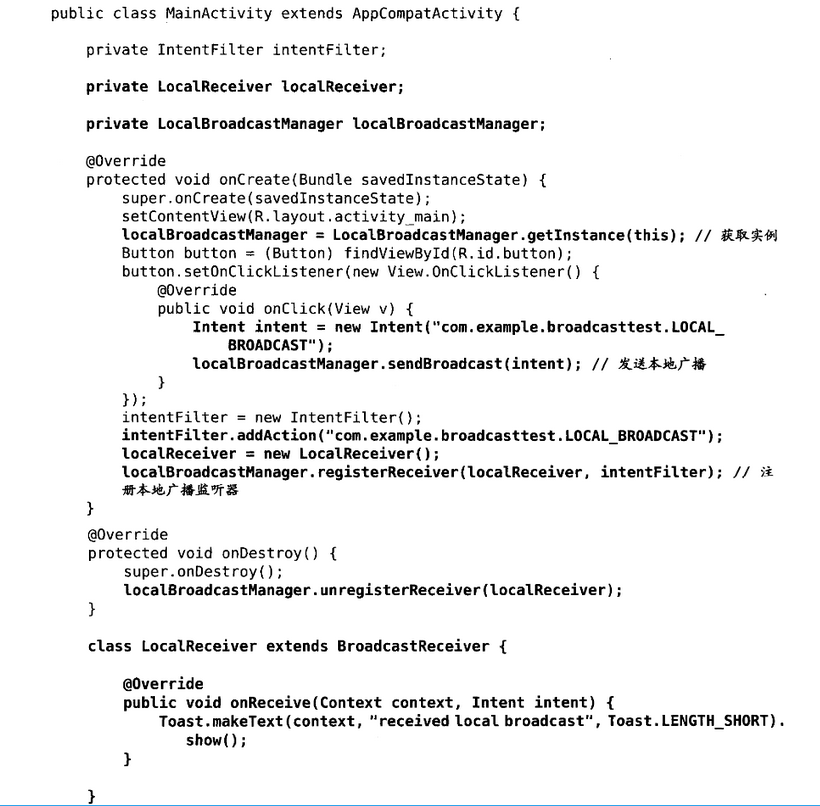

以上例子的解释

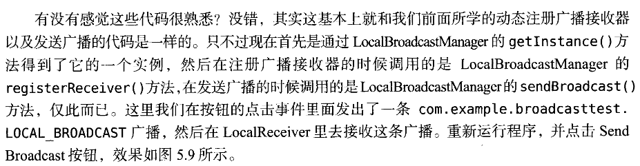