数据持久化提到的技术所保存的数据只能在当前的应用程序中访问，内容提供器突破了这一限制
<!--more-->

### 一个图示
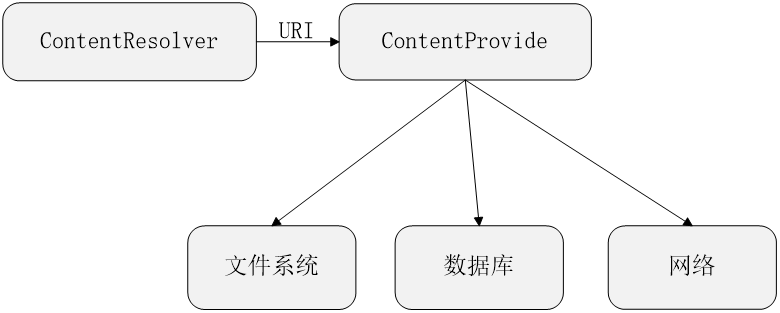

### 为什么需要内容提供器？
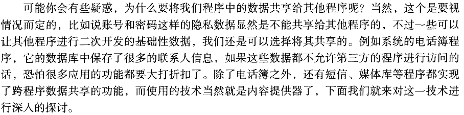

### 内容提供器简介
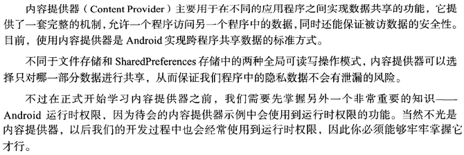

**访问其他程序中的数据**
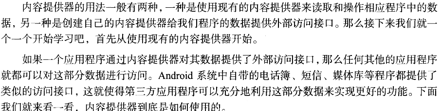

### ContentResolver的基本用法
**增删改查**
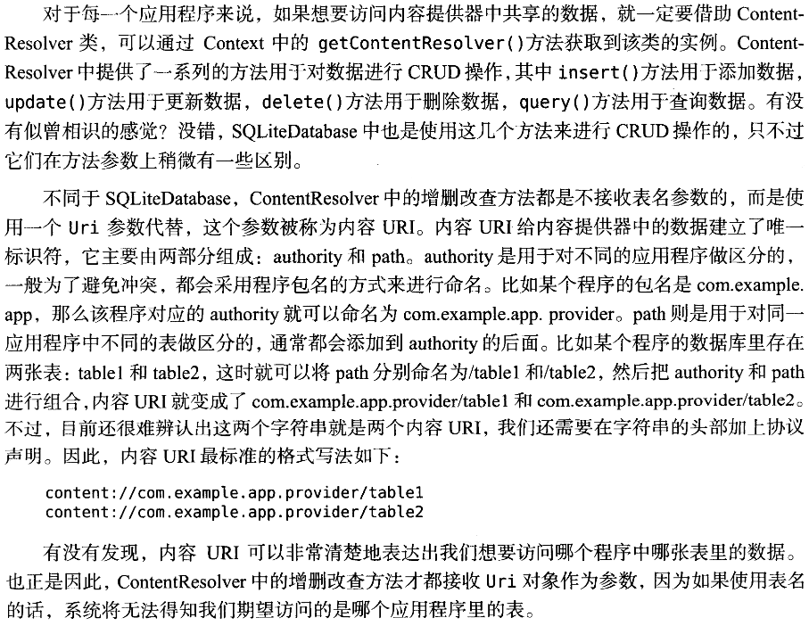
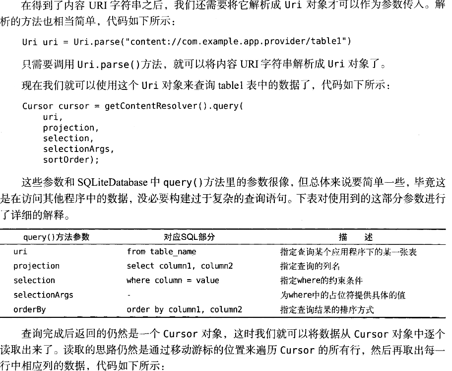
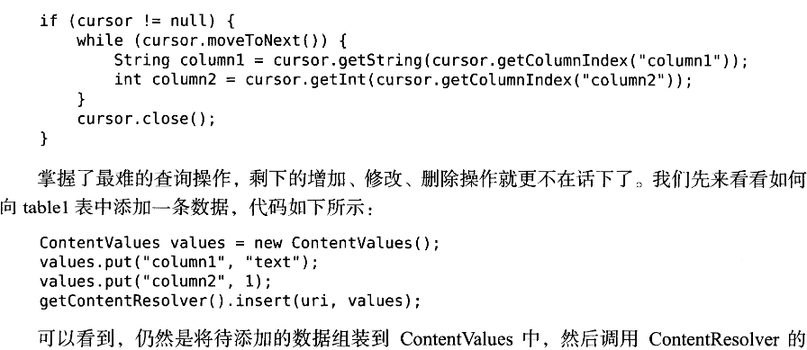
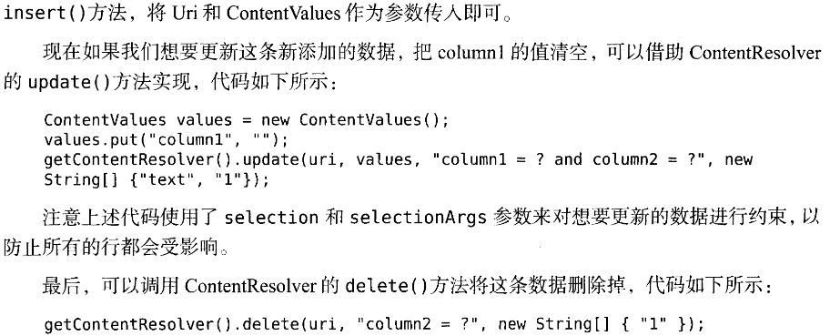

#### 读取联系人
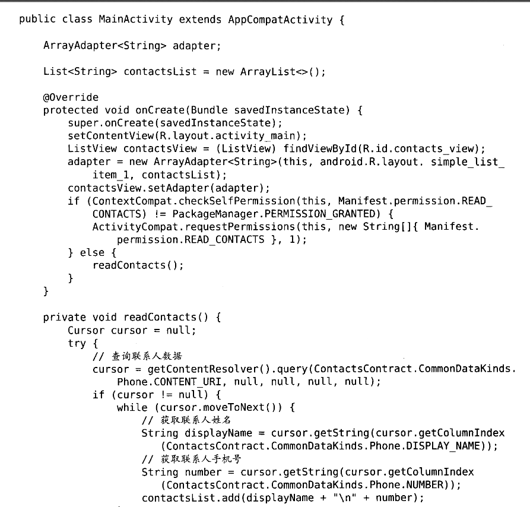
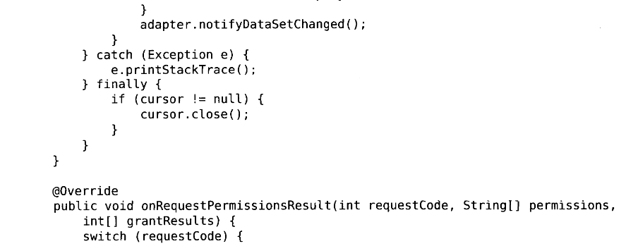

**以上代码解释**
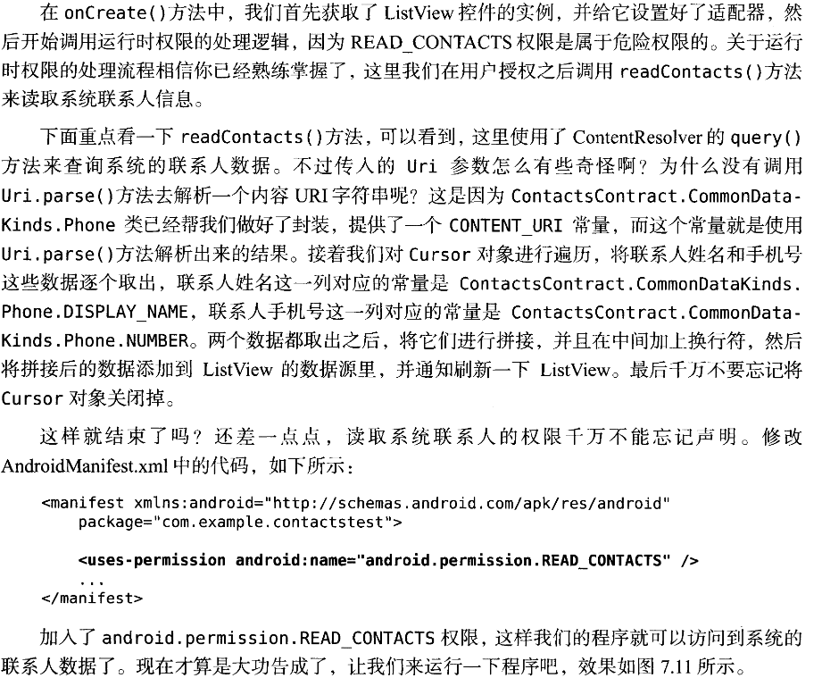

### 学会了消耗别人的内容提供器，现在我们来创建自己的内容提供器
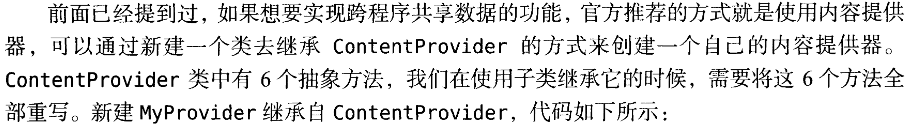
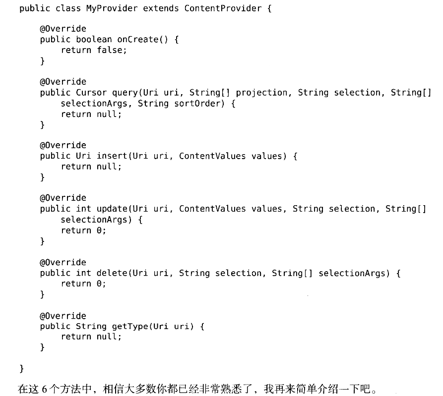
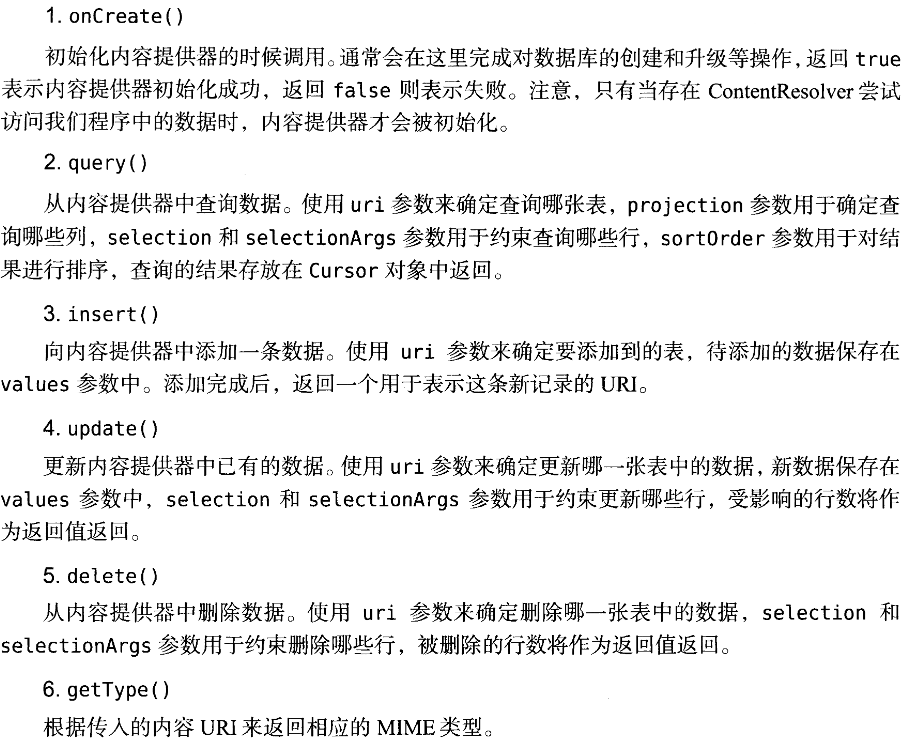
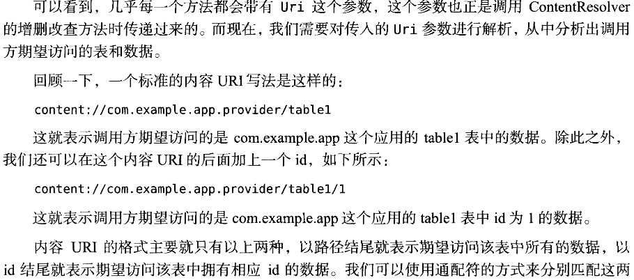
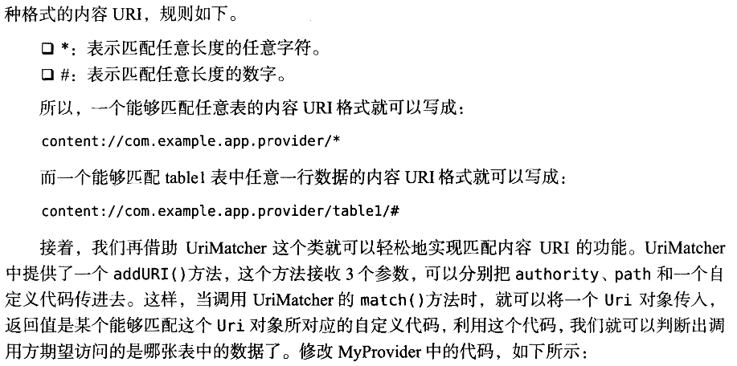
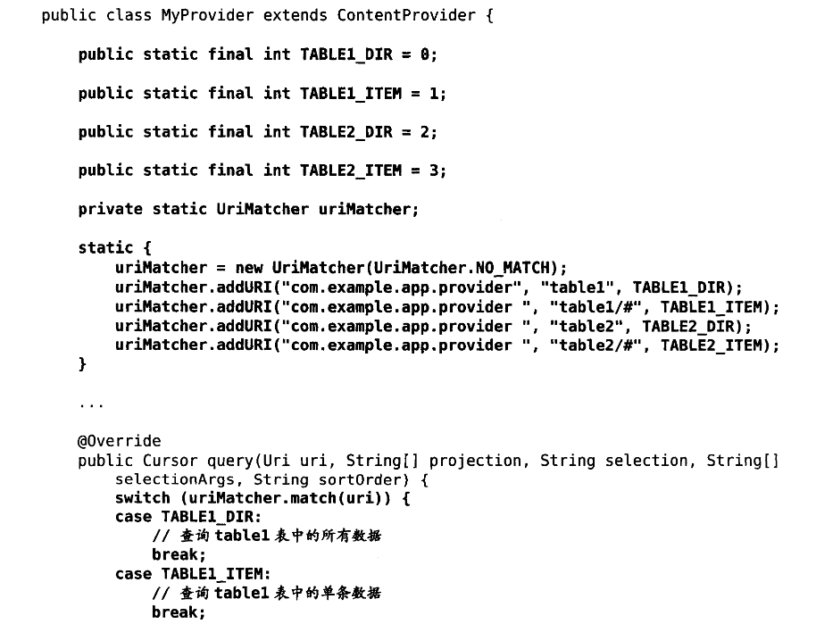
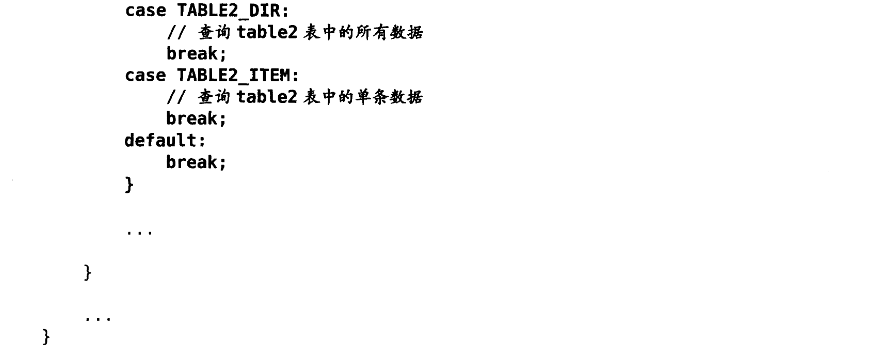
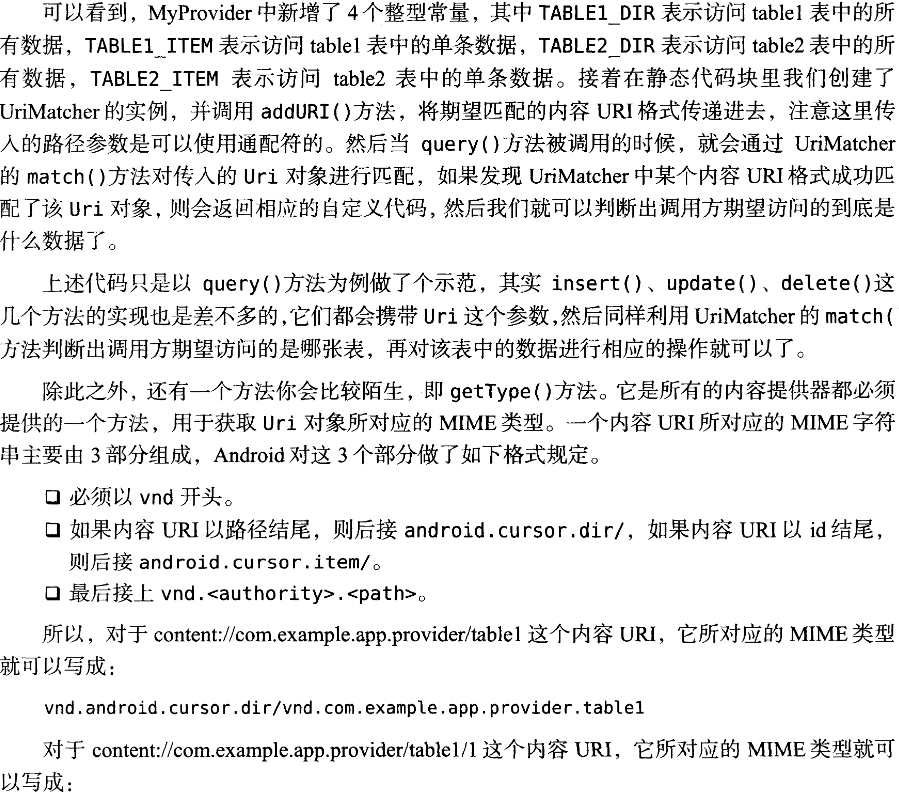
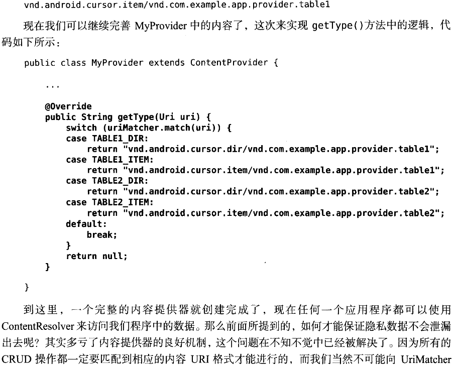
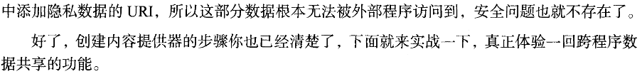

**//注意内容提供器也是四大组件之一，所以我们也必须在AndroidManifest.xml中进行注册**
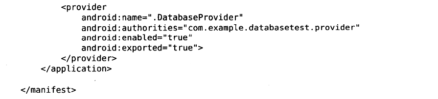

还有一个更为详尽的实践可以到<第一行代码>第二版去看