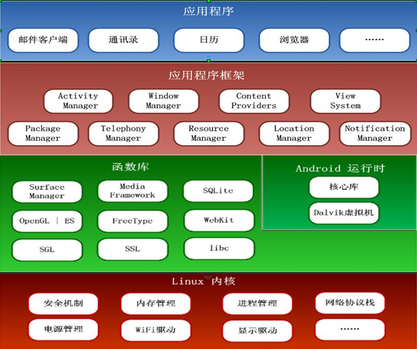
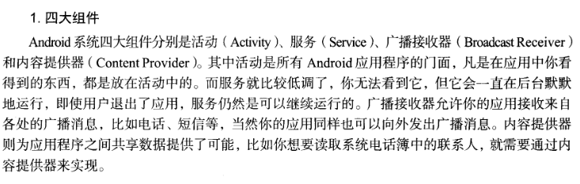
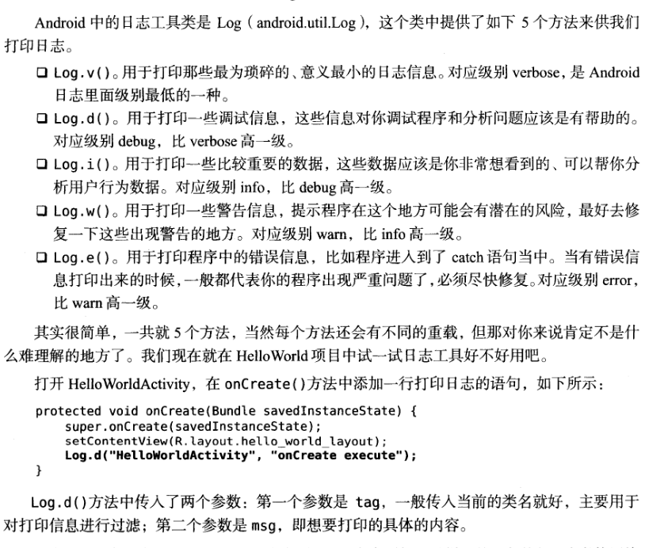
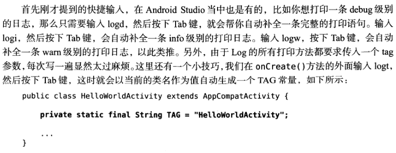
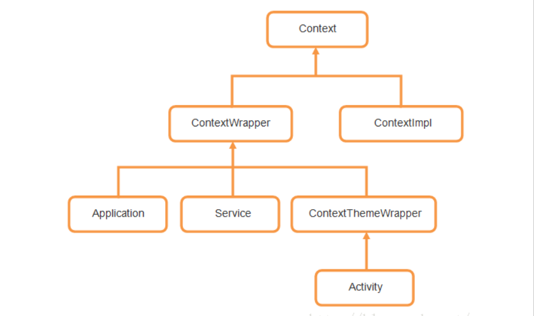

本系列是我阅读<第一行代码>所作的一些笔记，本篇是起始篇

<!--more-->
### 安卓四层架构



### 安卓四大组件简介
- Activity
- Service
- Broadcast Receiver
- Content Provider



### AndroidManifest.xml

四大组件都需要在这个文件里进行注册，具体注册查看文档
以注册Activity组件为例
```xml
<activity android:name=".HelloWorldActivity">
    <intent-filter>
        <action android:name="android.intent.action.MAIN">
        <category android:name="android.intent.category.LAUNCHER">
    </intent-filter>
</activity>
```

### HelloWorldActivity.java

```java
public class HelloWorldActivity extends AppCompatActivity{
    @Override
    public void onCreate(Bundle savedInstanceState){
        super.onCreate(savedInstanceState);
        setContentView(R.layout.hello_world_layout);
    }
}
```
继承AppCompatActivity,向下兼容的Activity，可以将Activity在各个系统版本中增加的特性和功能最低兼容到Android 2.1系统。Activity是Android系统提供的一个活动基类。我们项目中所有活动都必须继承它或者它的子类才能拥有活动的特性。(AppCompatActivity是Activity的子类)

onCreate()方法是一个活动被创建时必定要执行的方法。

#### 逻辑和视图分离
setContentView()方法，为当前活动引入一个hello_world_layout布局

### 日志工具



#### Android Studio的Log技巧


### Context上下文

#### 在下面文章中会一直出现的Context是什么？

我们知道，Android应用都是使用Java语言来编写的，那么大家可以思考一下，一个Android程序和一个Java程序，他们最大的区别在哪里？划分界限又是什么呢？其实简单点分析，Android程序不像Java程序一样，随便创建一个类，写个main()方法就能跑了，而是要有一个完整的Android工程环境，在这个环境下，我们有像Activity、Service、BroadcastReceiver等系统组件，而这些组件并不是像一个普通的Java对象new一下就能创建实例的了，而是要有它们各自的上下文环境，也就是我们这里讨论的Context。可以这样讲，Context是维持Android程序中各组件能够正常工作的一个核心功能类。


那么Context到底可以实现哪些功能呢？这个就实在是太多了，弹出Toast、启动Activity、启动Service、发送广播、操作数据库等等等等都需要用到Context。由于Context的具体能力是由ContextImpl类去实现的，因此在绝大多数场景下，Activity、Service和Application这三种类型的Context都是可以通用的。不过有几种场景比较特殊，比如启动Activity，还有弹出Dialog。出于安全原因的考虑，Android是不允许Activity或Dialog凭空出现的，一个Activity的启动必须要建立在另一个Activity的基础之上，也就是以此形成的返回栈。而Dialog则必须在一个Activity上面弹出（除非是System Alert类型的Dialog），因此在这种场景下，我们只能使用Activity类型的Context，否则将会出错。