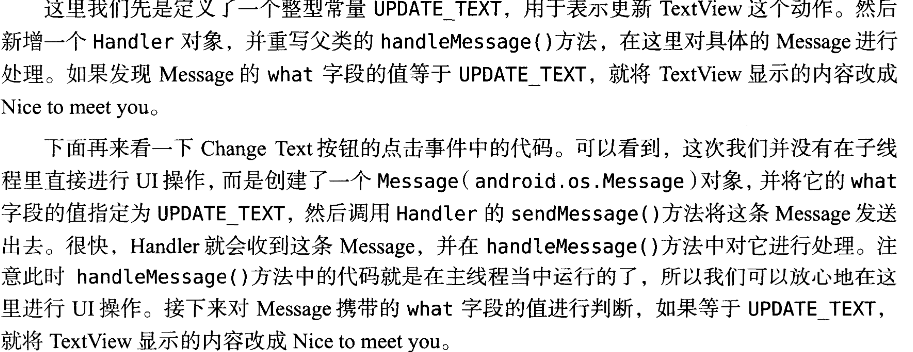
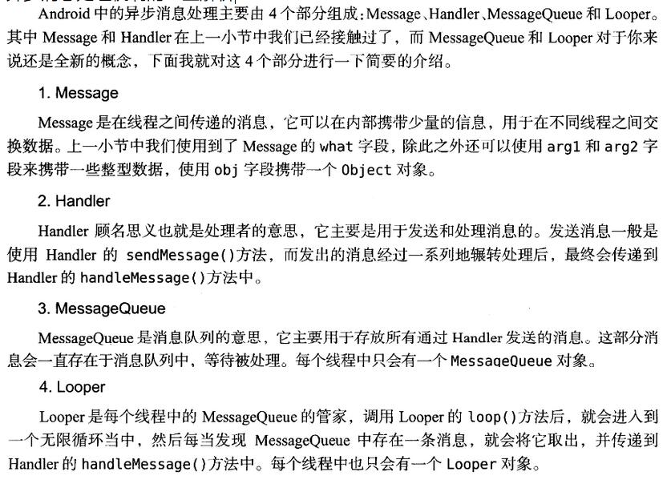
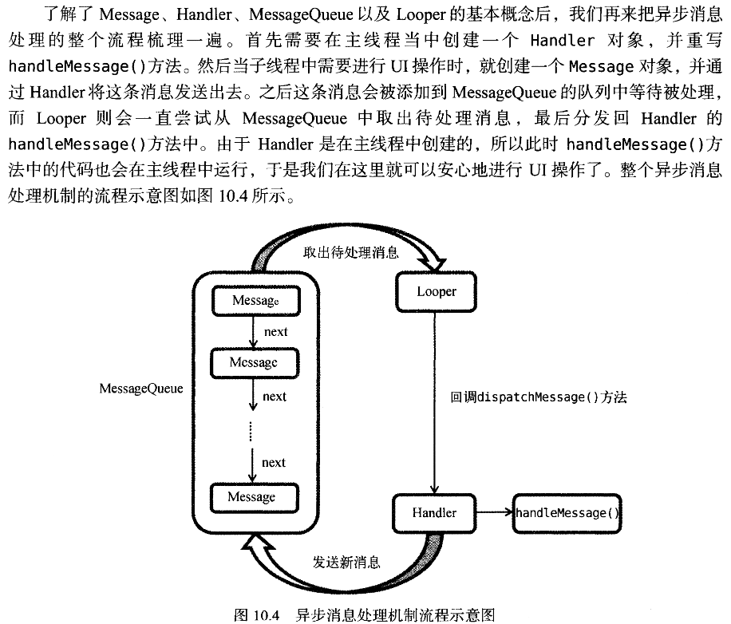
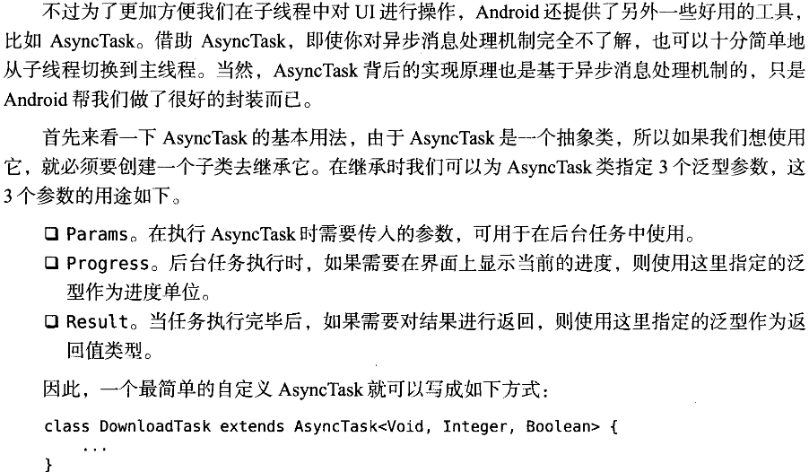
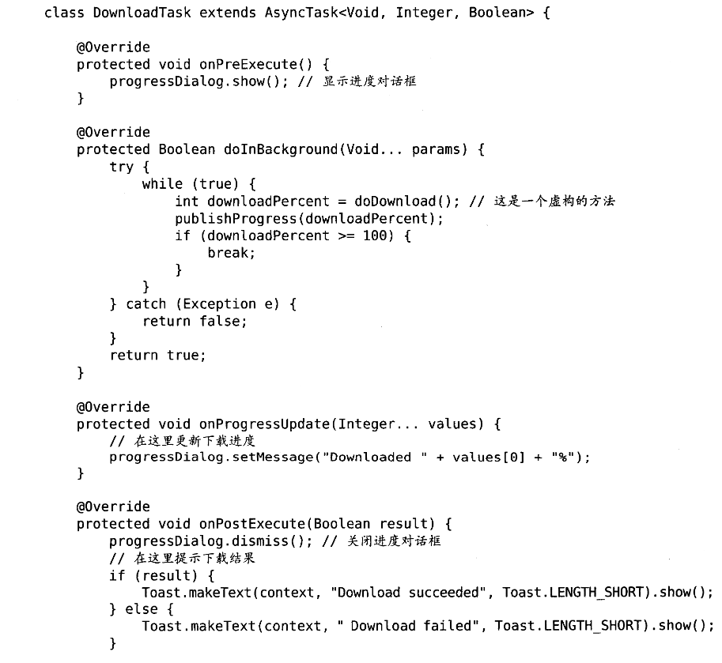
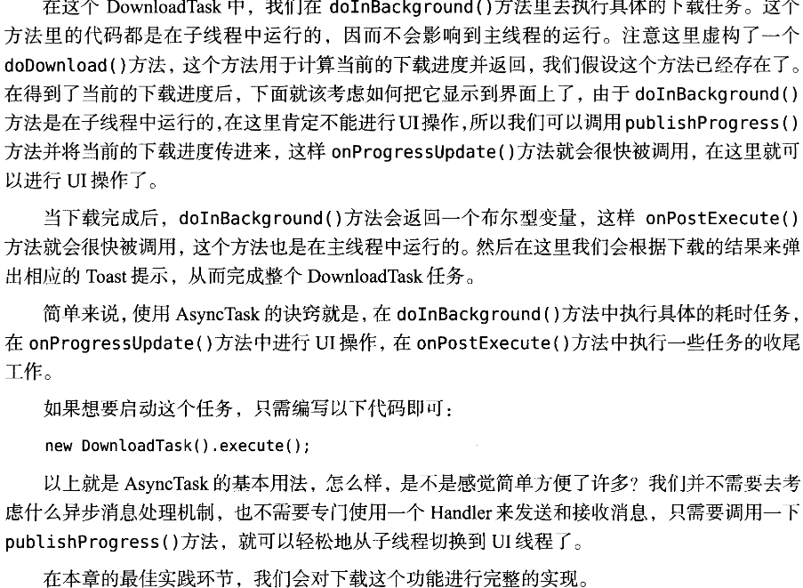

当我们需要执行一些耗时操作，比如说发起一条网络请求时，服务器未必会立即响应我们的请求。如果不将这类操作放在子线程里去执行，就会导致主线程被阻塞住。从而影响用户对软件的正常使用

<!--more-->

### 3种方式开启新线程

- 新建一个继承Thread的类
定义一个线程只需要继承Thread，并重写父类的run()方法即可
```java
    class MyThread extends Thread {
        @Override
        public void run(){
            //处理耗时的逻辑
        }
    }
```
如何启动这个线程?
new一个示例，然后调用实例的start()方法
```java
new MyThread().start();
```

- 新建一个实现Runnable接口的类
使用上面所说的继承方法耦合性有点高。更多时候选择实现Runable接口的方法来定义一个线程

```java
    class MyThread implements Runnable{
        @Override
        public void run(){
            //处理耗时逻辑
        }
    }
```
如何启动这个线程?
```java
MyThread myThread = new MyThread();
new Thread(myThread).start();
```
我们new出了一个实现了Runnable接口的对象myThread，而Thread构造函数可以接收一个Runnable参数。所以我们将myThread传入Thread构造函数new出Thread实例，然后再调用start()启动线程

- 匿名类的方式
这个方法其实本质上和上一个相同
```java
new Thread(new Runnable(){
    @Override
    public void run(){
        //这里处理耗时逻辑
    }
})
```

### 必须在主线程更新UI

在子线程中更新UI会导致程序崩溃，更新UI的操作必须在主线程中进行

有些时候，我们必须在子线程里去执行一些耗时任务，然后根据任务的执行结果来更新相应的UI控件。

```java
    public class MainActivity extends AppCompatActivity implements View.OnClickListener{
        public static final int UPDATE_TEXT = 1;
        private TextView text;
        private Handler handler = new Handler(){
            public void handleMessage(Message msg){
                switch(msg.what){
                    case UPDATE_TEXT:
                        //在这里可以进行UI操作
                        text.setText("Nice to meet you");
                        break;
                    default:
                        break;
                }
            }
        }
        ...
        @Override
        public void onClick(View v){
            case R.id.change_text:
                new Thread(new Runnable(){
                    @Override
                    public void run(){
                        Message message = new Message();
                        message.what = UPDATE_TEXT;
                        handler.sendMessage(message);
                    }
                }).start();
                break;
            default:
                break;
        }
    }
```

关于以上这段代码的解释如下


### 异步消息处理机制

再过一遍


#### 安卓的AsyncTask
AsyncTask简介


一个具体的AsyncTask例子


关于上面这段代码的解释
