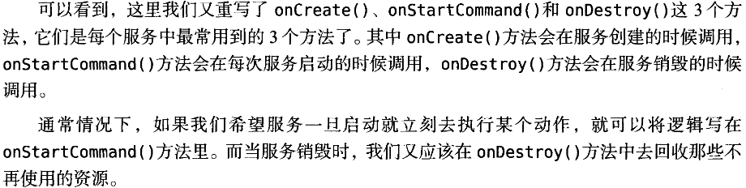
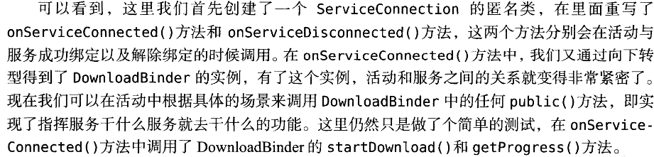
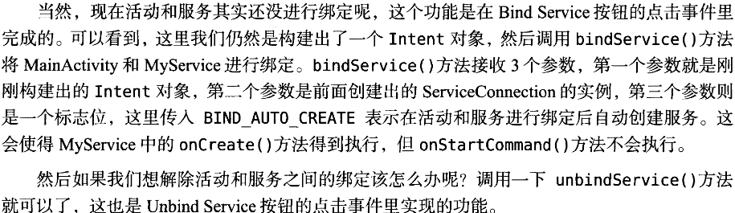
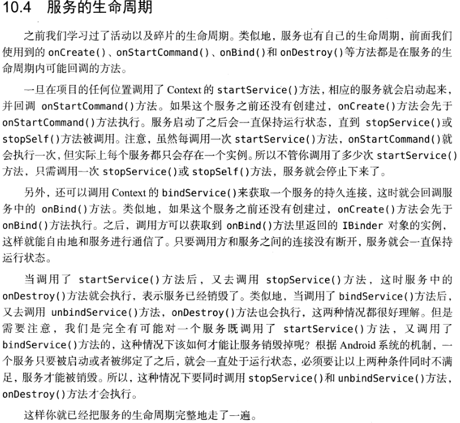
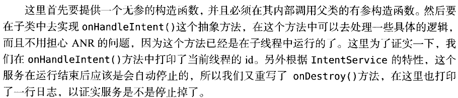
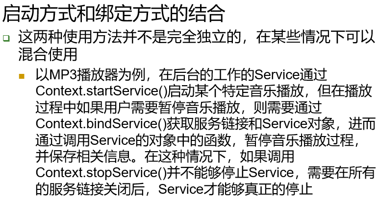
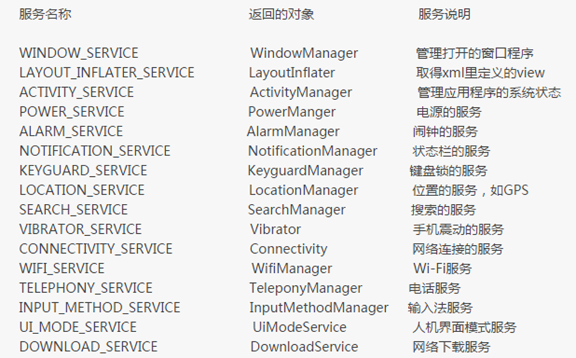
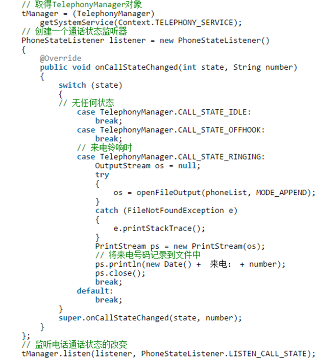

服务的运行不依赖于任何用户界面，即使程序被切换到后台，或者用户打开了另一个应用程序，服务仍然能够保持正常运行

尽管如此，服务并不是运行在一个独立的进程当中的，而是依赖于创建服务时所在的应用程序进程。当某个应用程序进程被杀掉时，所有依赖于该进程的服务也会停止运行

实际上服务也并不会自动开启线程，所有的代码都是默认运行在主线程当中的，也就是说我们需要在服务的内部手动创建子线程，并在这里执行具体的任务，否则可能出现主线程被阻塞的情况

<!--more-->

### 定义一个服务

#### 新建一个空Service
服务中处理事情的逻辑需要重写Service的另一些方法
```java
public class MyService extends Service {
    public MyService(){

    }
    @Override
    public IBinder onBind(Intent intent){
        throw new UnsupportedOperation("Not yet implemented");
    }
    @Override
    public void onCreate(){
        super.onCreate();
    }
    @Override
    public int onStartCommand(Intent intent,int flags,int startId){
        return super.onStartCommand(intent,flags,startId);
    }
    @Override
    public void onDestory(){
        super.onDestory();
    }
}
```
Service一些重载方法的作用


**注意Service作为四大组件之一所以也需要在AndroidManifest.xml中注册**

#### 启动和停止服务

启动
```java
Intent startIntent = new Intent(this,MyService.class);
startService(startIntent);
```
停止
```java
Intent stopIntent = new Intent(this,MyService.class);
stopService(stopIntent);
```
在Service中停止自己
```java
stopSelf();
```

#### 活动和服务进行通信

利用onBind()方法，在活动中指挥服务干什么，服务就去干什么

比如说，目前我们希望在MyService里提供一个下载功能，然后在活动中可以决定何时开始下载，以及随时查看下载进度。实现这个功能的思路是创建一个专门的Binder对象来对下载功能进行管理，修改MyService中的代码，如下所示
```java
public class MyService extends Service{
    private DownloadBinder mBinder = new DownloadBinder();

    class DownloadBinder extends Binder{
        public void startDownload(){
            Log.d("MyService","startDownload executed");
        }
        public int getProgress(){
            Log.d("MyService","getProgress executed");
            return 0;
        }
    }

    @Override
    public IBinder onBind(Intent intent){
        return mBinder;
    }
}
```
可以看到，这里我们新建了一个DownloadBinder类，并让它继承自Binder，然后在它的内部提供了开始下载以及查看下载进度的方法。当然这只是两个模拟方法，并没有实现真正的功能，我们在这两个方法中分别打印了一行日志。

接着，在MyService中创建了DownloadBinder的实例，然后在onBind()方法里返回了这个实例，这样MyService中的工作就全部完成了。

**在需要绑定服务的Activity里**

```java
public class MainActivity extends AppCompatActivity implements View.OnClickListener{
    private MyService.DownloadBinder downloadBinder;

    private ServiceConnection connection = new ServiceConnection(){
        @Override
        public void onServiceDisconnected(ComponentName name){

        }
        @Override
        public void onServiceConnected(ComponentName name,IBinder service){
            downloadBinder = (MyService.Downloader) service;
            downloadBinder.startDownload();
            downloadBinder.getProgress();
        }
    };

    @Override
    protected void onCreate(Bundle savedInstanceState){
        super.onCreate(savedInstanceState);
        setContentView(R.layout.activity_main);
        ...
        Button bindService = (Button) findViewById(R.id.bind_service);
        Button unbindService = (Button) findViewById(R.id.unbind_service);
        bindService.setOnClickListener(this);
        unbindService.setOnClickListener(this);
    }
    @Override
    protected void onClick(View v){
        switch(v.getId()){
            ...
            case R.id.bind_service:
                 Intent bindIntent = new Intent(this,MyService.class);
                 bindService(bindIntent,connection,BIND_AUTO_CREATE);
                 break;
            case R.id.unbind_service:
                 unbindService(connection);
                 break;
            default:
                 break;
        }
    }
}
```
**Acticity以上代码的解释**


**Activity的bindService()和unbindService()**


**服务可以和多个Activity绑定**

另外需要注意，任何一个服务在整个应用程序范围内都是通用的，即MyService不仅可以和MainActivity绑定，还可以和任何其他的活动进行绑定，而且绑定后他们都可以获取到相同的DownloadBinder实例

### 服务的生命周期


**使用前台服务**
...这部分先省略

**耗时服务的编写方法**

在服务的每个具体的方法里开启一个子线程，然后在这里去处理耗时逻辑
```java
public class MyService extends Service{
    ...
    @Override
    public int onStartCommand(Intent intent,int flags,int startId){
        new Thread(new Runnable(){
            @Override
            public void run(){
                //处理具体的逻辑
                stopSelf();
                //服务执行完毕后停止服务
            }
        }).start();
        return super.onStartCommand(intent,flags,startId)
    }
}
```

以上这种写法并不复杂，但是总会有一些程序员忘记开启线程，或者忘记调用stopSelf()方法。为了可以简单地创建一个异步的，会自动停止的服务，Android专门提供了一个IntentService类。这个类很好地解决了前面所提到的两种尴尬。下面我们就看一下他的用法
**使用IntentService**

```java
public class MyIntentService extends IntentService{
    public MyIntentService(){
        super("MyIntentService");
        //调用父类的有参构造函数
    }
    @Override
    protected void onHandlerIntent(Intent intent){
        //打印当前线程的id
        Log.d("MyIntentService","Thread is "+ Thread.currentThread().getId());
    }
    @Override
    public void onDestory(){
        super.onDestory();
        Log.d("MyIntentService","onDestory executed");
    }
}
```
MyIntentService里的代码解释


#### 混合使用
混合使用startService()stopService()和bindService()unbindService()
两组方法

一个具体解释


#### 安卓的系统服务
所有系统服务


所有系统服务，都可以通过getSystemService函数获得

以电话服务为例
```java
TelephonyManager t = (TelephonyManager) getSystemService(Context.TELEPHONY_SERVICE)
t.getDeviceId();//获得设备id
t.getNetworkOperatorName();//获得移动服务商猫宁子
t.getSimState();//获得sim卡状态
...
```
**一个监听通话状态的例子**

使用系统服务需要在AndroidManifest.xml中添加对相应服务的访问权限
```xml
<use-permisson android:name="android.permisson.READ_PHONE_STATE"/>
```
