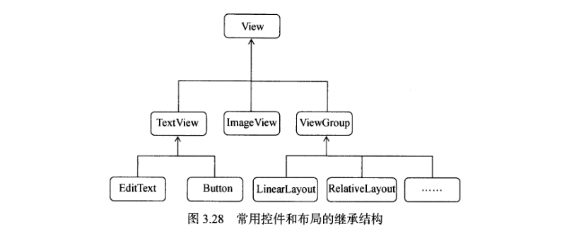
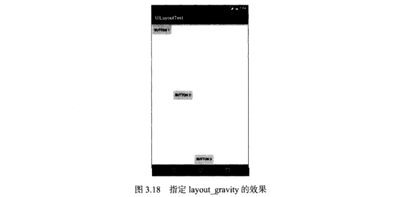
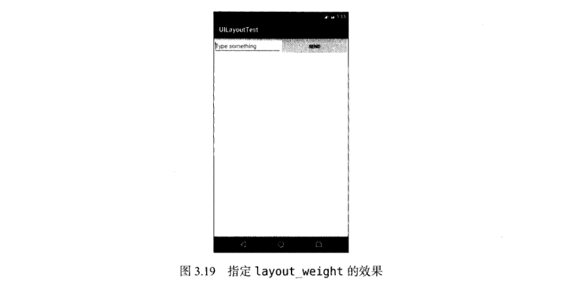
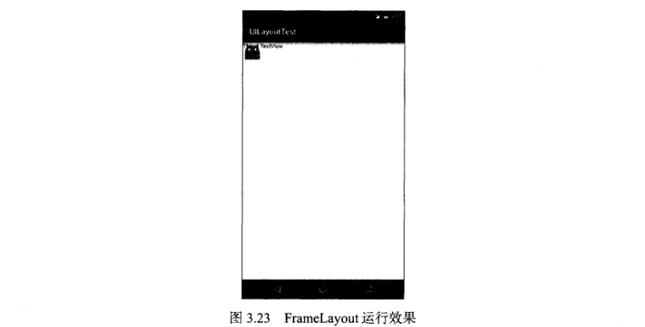

安卓一些常见的基本控件介绍，以及安卓四大布局的介绍。安卓几种Menu的介绍。安卓如何自定义控件

<!--more-->
### 布局和控件继承关系图


### 安卓常见的控件
- TextView
- Button
- EditText
- ImageView
- ProgressBar
- AlertDiag
- ...

在Activity相应的layout.xml文件里引用诸如
```xml
<TextView
    android:id="@+id/text_view"
    android:layout_width="mactch_parent"
    android:layout_height="wrap_content"
    android:gravity="center"
    android:textSize="24sp"
    android:textColor="#00ff00"
    android:text="This is TextView"
   />
```
*安卓没有像前端的css技术来决定内容的布局和样式，通过给xml添加attr来实现*

其余的控件也是大致的方式使用，就不一一介绍了

### 两种实现事件监听的方法
1. 匿名类方式注册监听器
```java
public class MainActivity extends AppCompatActivity{
    @Override
    protected void onCreate(Bundle savedInstanceState){
        super.onCreate(savedInstanceState);
        setContentView(R.layout.activity_main);
        Button button = (Button) findViewById(R.id.button);
        button.setOnClickListener(new View.OnClickListener(){
            @Override
            public void onClick(View v){
                //在此处添加逻辑
            }
        })
    }
}
```
2. 实现接口方式注册监听器

```java
public class MainActivity extends AppCompatActivity implements View.OnClickListener{
    @Override
    protected void onCreate(Bundle savedInstanceState){
        super.onCreate(savedInstanceState);
        setContentView(R.layout.activity_main);
        Button button = (Button) findViewById(R.id.button);
        button.setOnClickListener(this)
    }

    @Override
    public void onClick(View v){
        swith(v.getId()){
            case R.id.button:
                // 在此处添加逻辑
                break;
            default:
                break;
        }
    }

}
```
*后面一种方法有点类似前端中的事件委托*

### Menu

在res目录下新建menu文件夹，然后新建一个menu.xml
```xml
<menu xmlns:android="http://schemas.android.com/apk/res/android">
    <item
        android:id="@+id/add_item"
        android:title="Add"/>
    <item
        android:id="@+id/remove_item"
        android:title="Remove"/>
</menu>
```
item里面可以在<item>和</item>中间插入menu创建二级菜单
在需要引入这个目录的activity.java里
重写onCreateOptinosMenu()

```java
@Override
public boolean onCreateOptionsMenu(Menu menu){
    getMenuInflater().inflate(R.menu.main,menu);
    return true
}
```
又重写onOptionsItemSelected(MenuItem item)

```java
public boolean onOptionsItemSelected(MenuItem item){
    switch(item.getItemId()){
        case R.id.add_item:
            Toast.makeText(this,"You click Add",Toast.LENGTH_SHORT).show();
            break;
        case R.id.remove_item:
            Toast.makeText(this,"You click Remove",Toast.LENGTH_SHORT).show();
            break;
    }
}
```
除了OptionsMenu(按点击按钮，属于一整个Activity)还有ContextMenu（长按View）、PopupMenu（可以添加在任何事件里，用.show()弹出）

### 安卓控件的可见属性
android:visibility= visible | invisible | gone
visible:表示控件是可见的
invisible:表示控件不可见，但是它仍然占据着原来的位置和大小
gone:控件不仅不可及，而且不再占用任何屏幕空间
setVisibility():可传入View.VISIBLE、View.INVISIBLE和View.GONE

## 4种基本布局

### 线性布局LinearLayout

会将它所包含的控件在线性方向上依次排列
通过android:orientation=" vertical(默认) | horizontal "
 
android:layout_gravity:指定控件在布局(父控件)中的对齐方式
可选值和gravity差不多 也是 top | bottom | left | right | center | center_horizontal | center_vertical
(android:gravity:指定文字在控件中的对齐方式)

当LinearLayout的排列方式是horizontal时，只有垂直方向上的对齐方式才会生效，因为此时水平方向上的长度是不固定的，每添加一个控件，水平方向上的长度都会改变，因而无法指定该方向的对齐方式(下面一个例子)
```xml
<LinearLayout        xmlns:android="http://schemas.android.com/apk/res/android"    android:orientation="horizontal"
android:layout_width="match_parent"
android:layout_height="match_parent">
    <Button
        android:id="@+id/button1"
        android:layout_width="wrap_content"
        android:layout_height="wrap_content"
        android:layout_gravity="top"
        android:text="Button 1"/>
    <Button
        android:id="@+id/button2"
        android:layout_width="wrap_content"
        android:layout_height="wrap_content"
        android:layout_gravity="center_vertical"
        android:text="Button 2"/>
    <Button
        android:id="@+id/button3"
        android:layout_width="wrap_content"
        android:layout_height="wrap_content"
        android:layout_gravity="bottom"
        android:text="Button 3"/>
</LinearLayout>
```
以上代码的效果如图


另一个重要属性android:layout_weight
```xml
<LinearLayout        xmlns:android="http://schemas.android.com/apk/res/android"    android:orientation="horizontal"
android:layout_width="match_parent"
android:layout_height="match_parent">
    <EditText
        android:id="@+id/input_message"
        android:layout_width="0dp"
        android:layout_height="wrap_content"
        android:layout_weight="1"
        android:text="Type Something"/>
    <Button
        android:id="@+id/send"
        android:layout_width="0dp"
        android:layout_height="wrap_content"
        android:layout_weight="1"
        android:text="Send"/>
</LinearLayout>
```
以上代码效果如图


**使用了android:layout_weight之后控件的宽度不再由android:layout_width决定**

### 相对布局RelativeLayout
它通过相对定位的方式让控件出现在布局的任何位置。也正因如此，RelativeLayout中的属性非常多，但都是有规律可循的

**在控件上添加[相对于父布局进行定位]**
- layout_alignParentRight="true"
- layout_alignParentLeft
- layout_alignParentBottom
- layout_alignParentTop
- layout_centerInParent

**在控件上添加[相对于其他控件进行定位]**
- layout_above="@id/button3"
- layout_below
- layout_toLeftOf
- layout_toRightOf

### 帧布局FrameLayout
所有的控件都默认摆放在布局的左上角
```xml
<FrameLayout        xmlns:android="http://schemas.android.com/apk/res/android"    
android:layout_width="match_parent"
android:layout_height="match_parent">
    <TextView
        android:id="@+id/text_view"
        android:layout_width="wrap_content"
        android:layout_height="wrap_content"
        android:text="This is TextView"/>
    <ImageView
        android:id="@+id/image_view"
        android:layout_width="wrap_content"
        android:layout_height="wrap_content"
        android:text="@mipmap/ic_launcher"/>
</FrameLayout>
```
以上代码效果如图


### 百分比布局
...有点麻烦不想写了

## 自定义控件的方法
*在常见的MVVM框架中，我们也经常写一些自定义组件*

目标: 创建一个自定义标题栏，两个Button和一个TextView,在布局中摆好

1. 引入布局
*例如Vue里面的组件也要有template*
新建一个布局title.xml
```xml
<LinearLayout        xmlns:android="http://schemas.android.com/apk/res/android"
android:layout_width="match_parent"
android:layout_height="wrap_parent">
<!-- LinearLayout的默认布局为Verticle -->
    <Button
        android:id="@+id/title_back"
        android:layout_width="wrap_content"
        android:layout_height="wrap_content"
        android:layout_gravity="center"
        android:layout_margin="5dp"
        android:backgroud="@drawable/back_bg"
        android:text="Back"        android:textColor="#fff"/>
    <TextView
        android:id="@+id/title_text"
        android:layout_width="0dp"
        android:layout_height="wrap_content"
        android:layout_gravity="center"
        android:layout_weight="1"
        android:gravity="center"
        android:textColor="#fff"
        android:textSize="24sp"
        android:text="Title_Text"/>
        <!-- layout_gravity则是垂直于Liner方向上的对齐方式 -->
        <!-- gravity则是平行于Liner方向上的对齐方式 -->
    <Button
        android:id="@+id/title_edit"
        android:layout_width="wrap_content"
        android:layout_height="wrap_content"
        android:layout_margin="5dp"
        android:layout_gravity="center"
        android:backgroud="@drawable/edit_bg"
        android:textColor="#fff"
        android:text="Edit"/>
</LinearLayout>
```
**引入这个布局**
```xml
<LinearLayout        xmlns:android="http://schemas.android.com/apk/res/android"
android:layout_width="match_parent"
android:layout_height="wrap_parent">
<!-- LinearLayout的默认布局为Verticle -->
    <include layout="@layout/title">
</LinearLayout>
```
如上这样子引入布局没办法引入java也就没办法为控件添加响应事件等，下面会提到引入Java的方法

**隐藏掉系统自带的标题栏**
```java
public class MainActivity extends AppCompatActivity{
    @Override
    protected void onCreate(Bundle savedInstanceState){
        super.onCreate(savedInstanceState);
        setContentView(R.layout.activity_main);
        ActionBar actionBar = getSupportActionBar();
        if(actionBar != null){
            actionBar.hide();
        }
    }
}
```

2. 为自定义控件添加事件监听代码

*Vue里通过v:on一些methods里的函数*

新建TitleLayout继承自LinearLayout，让它成为我们自定义的标题栏控件，同时
```java
public class TitleLayout extends LinearLayout{
    public TitleLayout(Context context ,AttributeSet attrs){
        LayoutInflater.from(context).inflate(R.layout.title,this);
        Button titleBack = (Button) findViewById(R.id.title_back);
        Button titleEdit = (Button) findViewById(R.id.title_edit);
        titleBack.setOnClickListener(new OnClickListener(){
            @Override
            public void onClick(View v){
                ((Activity) getContext()).finish();
            }
        });
        titleEdit.setOnClickListener(new OnClickListener(){
            @Override
            public void onClick(View v){
               Toast.makeText(getContext(),"You click Edit Button",Toast.LENGTH_SHORT).show();
            }
        });
    }
}
```
这里用了LayoutInflater的from()可以构建一个LayouInflater对象，然后调用inflate()方法可以动态加载一个布局文件。

现在自定义控件已经创建好了.

3. 使用控件

然后我们需要在布局文件中添加这个自定义控件，修改activity_main.xml中的代码。如下

```xml
<LinearLayout        xmlns:android="http://schemas.android.com/apk/res/android"
android:layout_width="match_parent"
android:layout_height="wrap_parent">
<!-- LinearLayout的默认布局为Verticle -->
    <me.caistrong.uicustomviews.TitleLayout
        android:layout_width=“match_parent”
        android:layout_height=“wrap_content”/>
</LinearLayout>
```
添加自定义控件和添加普通控件的方式基本一样，不同之处在于添加自定义控件的时候我们需要指定控件的完整类名，包名在这里不可省略