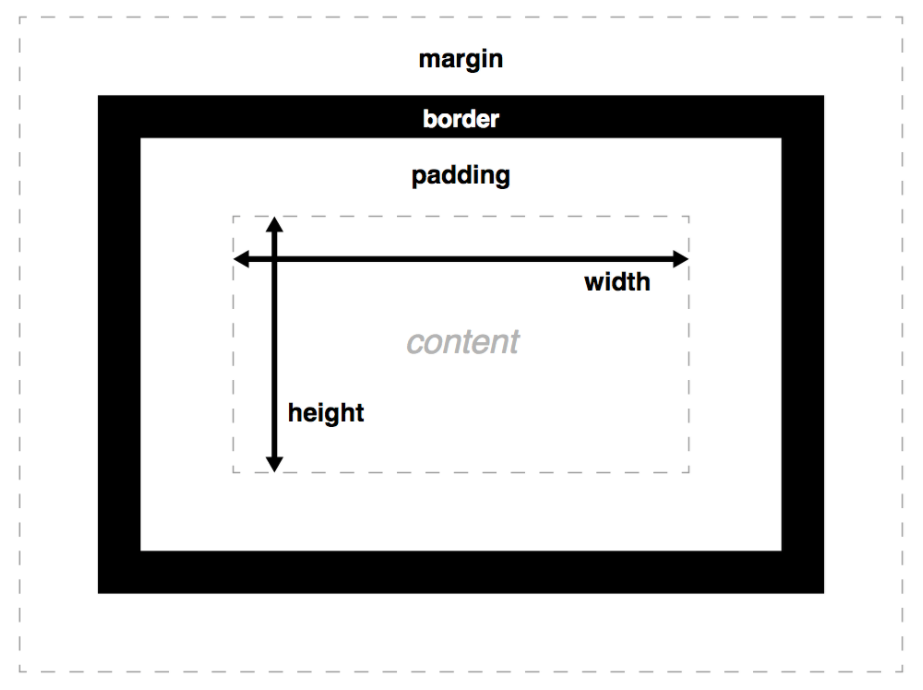
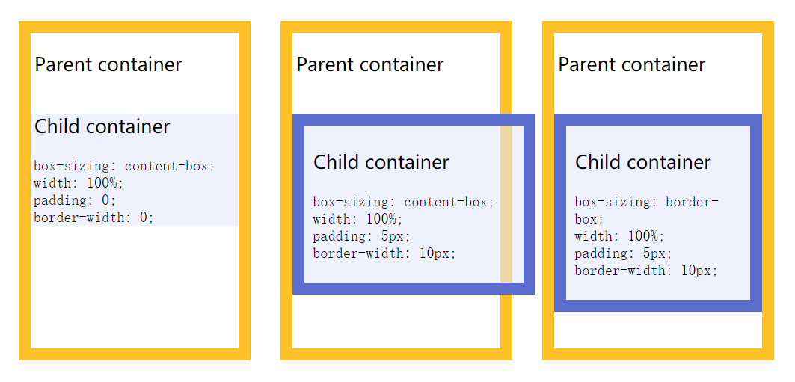
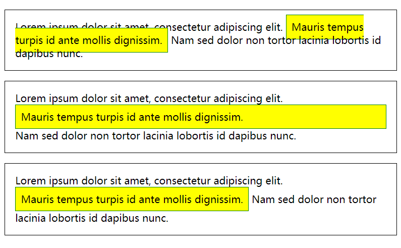
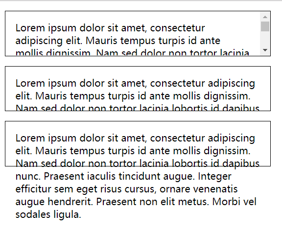

盒子模型是CSS永远绕不过去的话题

<!--more-->

### 基本模型

文档的每个元素被构造成文档布局内的一个矩形框，框每层的大小都可以使用一些特定的CSS属性调整。相关属性如下:



*还有其他属性可以更巧妙地处理内容的大小——设置大小约束而不是绝对的大小。这些属性包括min-width、max-width、min-height 和 max-height。*

*外边距有一个特别的行为被称作[外边距塌陷（margin collapsing）](https://developer.mozilla.org/zh-CN/docs/Web/CSS/CSS_Box_Model/Mastering_margin_collapsing)：当两个框彼此接触时，它们的间距将取两个相邻外边界的最大值，而非两者的总和。*

#### 设置宽高的约束
```
div{
    width: 70%;
    max-width: 1280px;
    min-width: 480px;
    margin: 0 auto;
}
```
0会使顶部和底部边距为0，而auto（在这种情况下）共享父容器左右边距之间的可用空间使它居中。 最终的呈现的效果是：当父容器在最小和最大宽度限制内时，它将填满整个视口宽度；当父容器超过1280px宽度时，布局将保持在1280px宽，并开始在可用空间内居中。 当宽度低于480px时，视口将小于容器，您必须滚动才能看得到完全的内容。

#### box-sizing
```css
box-sizing: content-box;(默认值：框的宽度和高度等于通过CSS设置在 content 的宽度和高度)
box-sizing: border-box;（框的宽度和高度等于content + padding + border）
```


#### display
HTML标签有块级元素和行内元素之分。其实可以理解为默认有display:block,display:inline之分,可以通过修改display属性来切换块级元素和行内元素。

在本篇文章，我们将关注三个最普遍的类型：block, inline, and inline-block。

- 块框（ block box）是定义为堆放在其他框上的框（例如：其内容会独占一行），而且可以设置它的宽高，之前所有对于框模型的应用适用于块框 （ block box）
- 行内框（ inline box）与块框是相反的，它随着文档的文字（例如：它将会和周围的文字和其他行内元素出现在同一行，而且它的内容会像一段中的文字一样随着文字部分的流动而打乱），**对行内盒设置宽高无效**，设置padding, margin 和 border都会更新周围文字的位置，但是对于周围的的块框（ block box）不会有影响。
- 行内块状框（inline-block box） 像是上述两种的集合：它不会重新另起一行但会像行内框（ inline box）一样随着周围文字而流动，而且他能够设置宽高，并且像块框一样保持了其块特性的完整性，它不会在段落行中断开。（在下面的示例中，行内块状框会放在第二行文本上，因为第一行没有足够的空间，并且不会突破两行。然而，如果没有足够的空间，行内框会在多条线上断裂，而它会失去一个框的形状。）
- display:flex可以启用flexbox布局
来个直观的例子吧


```html
<p>
   Lorem ipsum dolor sit amet, consectetur adipiscing elit.
   <span class="inline">Mauris tempus turpis id ante mollis dignissim.</span>
   Nam sed dolor non tortor lacinia lobortis id dapibus nunc.
</p>

<p>
  Lorem ipsum dolor sit amet, consectetur adipiscing elit.
  <span class="block">Mauris tempus turpis id ante mollis dignissim.</span>
  Nam sed dolor non tortor lacinia lobortis id dapibus nunc.
</p>

<p>
  Lorem ipsum dolor sit amet, consectetur adipiscing elit.
  <span class="inline-block">Mauris tempus turpis id ante mollis dignissim.</span>
  Nam sed dolor non tortor lacinia lobortis id dapibus nunc.
</p>
```
```css
p {
  padding : 1em;
  border  : 1px solid black;
}

span {
  padding : 0.5em;
  border  : 1px solid green;

  /* That makes the box visible, regardless of its type */
  background-color: yellow;
}

.inline       { display: inline;       }
.block        { display: block;        }
.inline-block { display: inline-block; }
```


#### overflow
当你使用绝对的值设置了一个框的大小（如，固定像素的宽/高），允许的大小可能不适合放置内容，这种情况下内容会从盒子溢流。我们使用overflow属性来控制这种情况的发生。它有一些可能的值，但是最常用的是：

- auto: 当内容过多，溢流的内容被隐藏，然后出现滚动条来让我们滚动查看所有的内容。
- hidden: 当内容过多，溢流的内容被隐藏。
- visible: 当内容过多，溢流的内容被显示在盒子的外边（这个是默认的行为）

```html
<p class="autoscroll">
   Lorem ipsum dolor sit amet, consectetur adipiscing elit.
   Mauris tempus turpis id ante mollis dignissim. Nam sed
   dolor non tortor lacinia lobortis id dapibus nunc. Praesent
   iaculis tincidunt augue. Integer efficitur sem eget risus
   cursus, ornare venenatis augue hendrerit. Praesent non elit
   metus. Morbi vel sodales ligula.
</p>

<p class="clipped">
   Lorem ipsum dolor sit amet, consectetur adipiscing elit.
   Mauris tempus turpis id ante mollis dignissim. Nam sed
   dolor non tortor lacinia lobortis id dapibus nunc. Praesent
   iaculis tincidunt augue. Integer efficitur sem eget risus
   cursus, ornare venenatis augue hendrerit. Praesent non elit
   metus. Morbi vel sodales ligula.
</p>

<p class="default">
   Lorem ipsum dolor sit amet, consectetur adipiscing elit.
   Mauris tempus turpis id ante mollis dignissim. Nam sed
   dolor non tortor lacinia lobortis id dapibus nunc. Praesent
   iaculis tincidunt augue. Integer efficitur sem eget risus
   cursus, ornare venenatis augue hendrerit. Praesent non elit
   metus. Morbi vel sodales ligula.
</p>
```
```css
p {
  width  : 400px;
  height : 2.5em;
  padding: 1em 1em 1em 1em;
  border : 1px solid black;
}

.autoscroll { overflow: auto;    }
.clipped    { overflow: hidden;  }
.default    { overflow: visible; }
```
效果如下...感觉不需要解释了


#### background-clip
框的背景是由颜色和图片组成的，它们堆叠在一起（background-color, background-image）。 它们被应用到一个盒子里，然后被画在盒子的下面。默认情况下，背景延伸到了边界外沿。这通常是OK的，但是在一些情况下比较讨厌（假使你有一个平铺的背景图，你只想要它延伸到内容的边沿会怎么做？），该行为可以通过设置盒子的background-clip属性来调整。
```html
<div class="default"></div>
<div class="padding-box"></div>
<div class="content-box"></div>
```
```css
div {
  width  : 60px;
  height : 60px;
  border : 20px solid rgba(0, 0, 0, 0.5);
  padding: 20px;
  margin : 20px 0;

  background-size    : 140px;
  background-position: center;
  background-image   : url('https://mdn.mozillademos.org/files/11947/ff-logo.png');
  background-color   : gold;
}

.default     { background-clip: border-box;  }
.padding-box { background-clip: padding-box; }
.content-box { background-clip: content-box; }
```


#### 参考资料
*说来惭愧 这里基本上是全来自*
[MDN 的盒模型](https://developer.mozilla.org/zh-CN/docs/Learn/CSS/Introduction_to_CSS/Box_model)

