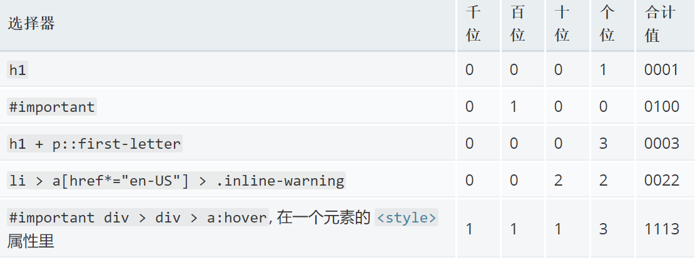
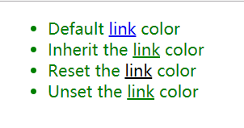

元素的最终样式可以在多个地方定义，它们以复杂的形式相互影响。这些复杂的相互作用使CSS变得非常强大，但也使其非常难于调试和理解。这篇文章旨在明晰其中的部分复杂性：主要包括层叠和继承两种机制

<!--more-->

## 层叠
CSS 是 Cascading Style Sheets 的缩写，这暗示层叠（cascade）的概念是很重要的。在最基本的层面上，它表明CSS规则的顺序很重要，但它比那更复杂。什么选择器在层叠中胜出取决于三个因素（这些都是按重量级顺序排列的——前面的的一种会否决后一种）：

1. 重要性（Importance）
2. **专用性（Specificity）**
3. 源代码次序（Source order）

大部分情况下是由专用性决定的

### 重要性

!important 总是优先
```css
.first{
    border: none !important
}
/* 不管怎样这个first类控制的元素别想有边框了 */
```

*知道 !important存在是很有用的，这样当你在别人的代码中遇到它时，你就知道它是什么了。**但是！**我们建议你千万不要使用它，除非你绝对必须使用它。您可能不得不使用它的一种情况是，当您在CMS中工作时，您不能编辑核心的CSS模块，并且您确实想要重写一种不能以其他方式覆盖的样式。 但是，如果你能避免的话，不要使用它。由于 !important 改变了层叠正常工作的方式，因此调试CSS问题，尤其是在大型样式表中，会变得非常困难。*

### 专用性
一个选择器具有的专用性的量是用四种不同的值（或组件）来衡量的，它们可以被认为是千位，百位，十位和个位——在四个列中的四个简单数字：

1. 千位：如果声明是在style 属性中该列加1分（这样的声明没有选择器，所以它们的专用性总是1000。）否则为0。
2. 百位：在整个选择器中每包含一个ID选择器就在该列中加1分。
3. 十位：在整个选择器中每包含一个类选择器、属性选择器、或者伪类就在该列中加1分。
4. 个位：在整个选择器中每包含一个元素选择器或伪元素就在该列中加1分。

*通用选择器 (*), 复合选择器 (+, >, ~, ' ') 和否定伪类 (:not) 在专用性中无影响。*



### 源代码次序
如上所述，如果多个相互竞争的选择器**具有相同的重要性和专用性**，那么第三个因素将帮助决定哪一个规则获胜——后面的规则将战胜先前的规则。
```css
p {
  color: blue;
}

/* This rule will win over the first one */
p {
  color: red;
}
```

## 继承

CSS继承是我们需要研究的最后一部分，以获取所有信息并了解什么样式应用于元素。其思想是，应用于某个元素的一些属性值将由该元素的子元素继承，而有些则不会。

- 例如，对 font-family 和 color 进行继承是有意义的，因为这使得您可以很容易地设置一个站点范围的基本字体，方法是应用一个字体到 <html> 元素；然后，您可以在需要的地方覆盖单个元素的字体。如果要在每个元素上分别设置基本字体，那就太麻烦了。
- 再如，让 margin，padding，border 和 background-image 不被继承是有意义的。想象一下，如果您将这些属性设置在一个容器元素上，并将它们继承到每个子元素，然后不得不将它们全部放在每个单独的元素上，那么将会出现的样式/布局混乱。
 

哪些属性默认被继承哪些不被继承大部分符合常识。如果你想确定，你可以参考[MDN CSS参考](https://developer.mozilla.org/zh-CN/docs/Web/CSS/Reference)—— 每个单独的属性页都会从一个汇总表开始，其中包含有关该元素的各种详细信息，包括是否被继承。

### 控制继承
CSS为处理继承提供了三种特殊的通用属性值：

- inherit： 该值将应用到选定元素的属性值设置为与其父元素一样。
- initial ：该值将应用到选定元素的属性值设置为与浏览器默认样式表中该元素设置的值一样。如果浏览器默认样式表中没有设置值，并且该属性是自然继承的，那么该属性值就被设置为 inherit。
- unset ：该值将属性重置为其自然值，即如果属性是自然继承的，那么它就表现得像 inherit，否则就是表现得像 initial。

*initial 和 unset 不被IE支持。*

**看一个例子**

```html
<ul>
  <li>Default <a href="#">link</a> color</li>
  <li class="inherit">Inherit the <a href="#">link</a> color</li>
  <li class="initial">Reset the <a href="#">link</a> color</li>
  <li class="unset">Unset the <a href="#">link</a> color</li>
</ul>
```
```css
body {
  color: green;
}

.inherit a {
  color: inherit;
}

.initial a {
  color: initial
}

.unset a {
  color: unset;
}
```
结果如下：


解释如下:

> 1. 我们首先设置`<body>` 的color为绿色。
2. 由于color属性是自然继承的，所有的body子元素都会有相同的绿色。需要注意的是默认情况下浏览器设置链接的颜色为蓝色，而不是自然继承color属性，因此在我们列表中的第一个链接是蓝色的。
3. 第二个规则设置一个类 inherit 的元素内的链接，并从父类继承它的颜色。在这种情况下, 意思是说链接继承了父元素`<li>`的颜色，默认情况下`<li>`的颜色来自于它的父元素 `<ul>` , 最后`<ul>` 继承自 `<body>`元素，而`<body>`的color 根据第一条规则设置成了绿色。
4. 第三个规则选择了在元素上使用类 initial 的任意链接然后设置他们的颜色为 initial 。通常， initial 的值被浏览器设置成了黑色，因此该链接被设置成了黑色。
5. 最后一个规则选择了在元素上使用类 unset 的所有链接然后设置它们的颜色为 unset  ——即我们不设置值。因为color属性是一个自然继承的属性，它实际上就像把值设置成 inherit 一样。结果是，该链接被设置成了与body一样的颜色——绿色。
