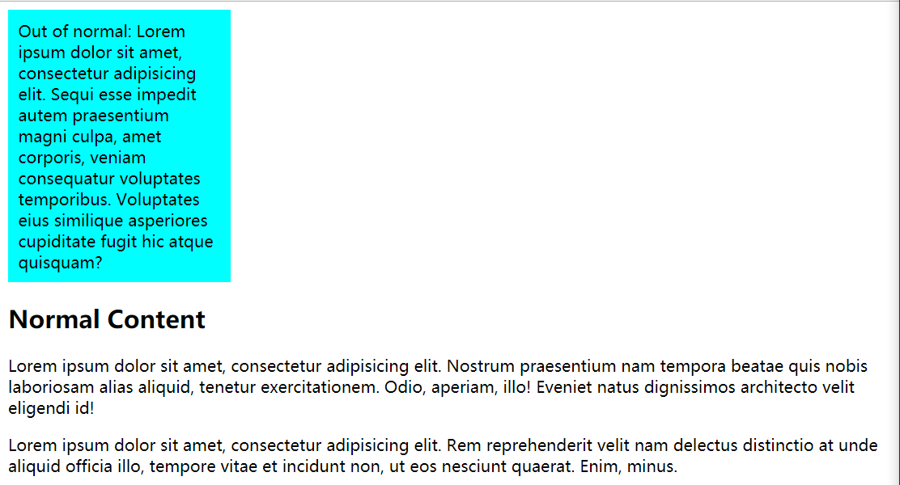
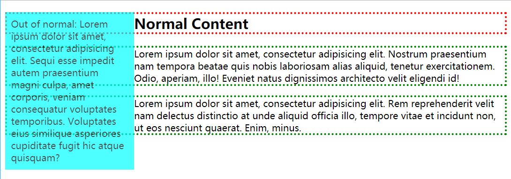
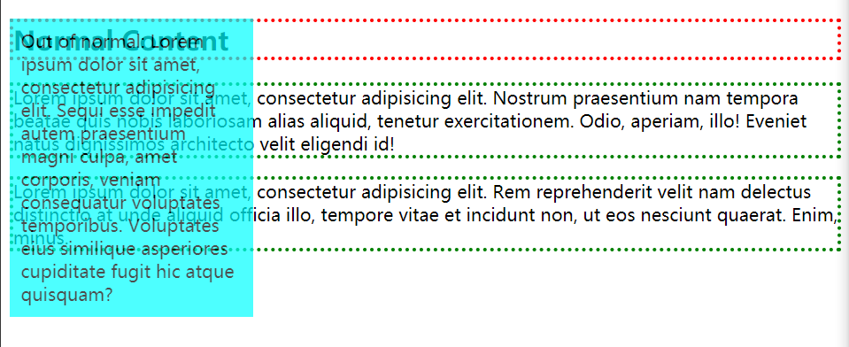

Normal FLow(文档流、普通流)是指在不对页面进行任何布局控制时，浏览器默认的HTML布局方式。我们讨论CSS布局就从文档流开始。

<!--more-->

## 文档流

html的标签有块级元素(常见的html标签中如 div, form, ul, li, p, h1)、行内元素之分(常见的html标签中如 span, img, font, a, b, em)。可以分别视为display:block,display:inline。

文档流的过程如下
1. 块级元素按照其在HTML中的顺序，在其容器框里从左上角开始，从上到下垂直地依次分配空间、堆砌( stack )，并独占一行，边界紧贴父容器。两相邻元素间的距离由 margin 属性决定
2. 行内元素从容器的顶端开始，一个接一个地水平排布。水平填充、边框和边距对行内元素有效。但垂直的填充、边框和空白边不影响其高度。

[更高深的文档流介绍参考这里](https://swordair.com/css-positioning-schemes-normal-flow/)

## 脱离文档流
> An element is called out of flow if it is floated, absolutely positioned, or is the root element. An element is called in-flow if it is not out-of-flow. The flow of an element A is the set consisting of A and all in-flow elements whose nearest out-of-flow ancestor is A.
以上截取自W3C文档。我们可以简单理解为。**被float和被绝对定位的元素会脱离文档流**。除了这两种情况(其实还有fixed定位)以外的情况下，布局都是按照normal flow(文档流)的过程来布局的

*脱离文档流可以理解为元素释放了原本占据的空间，浮向了往上一层的图层*

而float元素和绝对定位的元素脱离文档流的方式有不同之处，下面会具体提到

*Floated elements **remain a part of the flow of the web page**. This is distinctly different than page elements that use absolute positioning. Absolutely positioned page elements are removed from the flow of the webpage*

先来一段html代码，我们等下要让outofnormal这个div脱离文档流
```html
<body>
	<div id="outofnormal">
		Out of normal: 
		Lorem ipsum dolor sit amet, consectetur adipisicing elit. Sequi esse impedit autem praesentium magni culpa, amet corporis, veniam consequatur voluptates temporibus. Voluptates eius similique asperiores cupiditate fugit hic atque quisquam?
	</div>
	<h2>Normal Content</h2>
	<p>Lorem ipsum dolor sit amet, consectetur adipisicing elit. Nostrum praesentium nam tempora beatae quis nobis laboriosam alias aliquid, tenetur exercitationem. Odio, aperiam, illo! Eveniet natus dignissimos architecto velit eligendi id!</p>
	<p>Lorem ipsum dolor sit amet, consectetur adipisicing elit. Rem reprehenderit velit nam delectus distinctio at unde aliquid officia illo, tempore vitae et incidunt non, ut eos nesciunt quaerat. Enim, minus.</p>
</body>
```
```css
/* 为了方便观察添加的CSS */
#outofnormal {
	width: 200px;
	background-color: cyan;
	padding: 10px;
}
```
以上元素都置于普通流的布局时效果如下

### 脱离文档流的浮动框

更改css代码
```css
#outofnormal {
	width: 200px;
	background-color: cyan;
    opacity:0.7;
	padding: 10px;
    float:left;
    /* 这下这个div脱离文档流了 */
}
h2{
    border: 3px dotted red;
}
p{
    border: 3px dotted green;
}
```
效果如下

我们可以看到，现在#outofnormal这个div脱离文档流了，所以后面那些还在文档流的元素无视了#outofnormal这个div浮动框。填满了他原先占有的位置。然而。我们发现标题Normal Content,以及p标签的文字依然意识到了浮动框的存在，并自己向右空出了浮动框的位置。（有人称作是float元素脱离了文档流，但不脱离文本流。）

### 脱离文档流的绝对定位

将上文给出的CSS代码，删掉float:left。然后加上
```css
#outofnormal {
    position:absolute;
}
```
效果如下


嗯。。这下完全脱离文档流了

#### 参考资料
[关于CSS脱离文档流 by张秋怡](https://www.zhihu.com/question/24529373/answer/29135021)